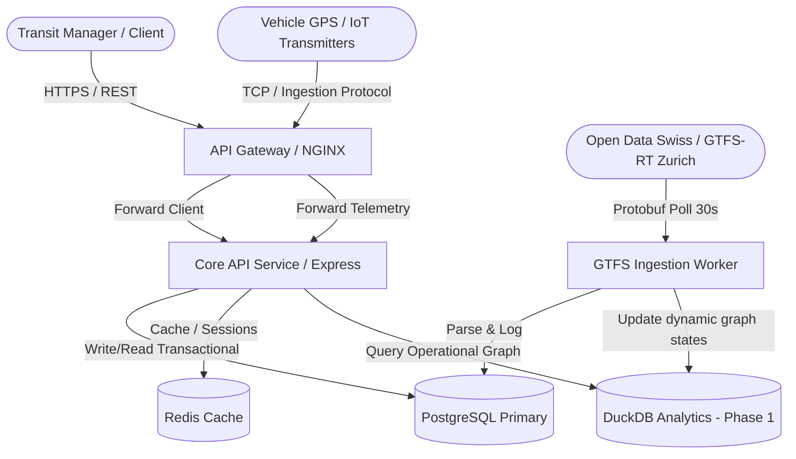

# System Architecture Overview

This document describes the high-level architecture, module boundaries, data-flows, and design constraints of the **Transit Intelligence** platform.

## Architectural Paradigm: Modular Monolith

We adopt a modular monolith architecture organized via monorepo packages. Modules are isolated via strict boundary interfaces, communicating through shared contracts and interfaces. This maximizes local iteration speed and refactoring simplicity, while laying down simple migration paths to individual microservices if traffic requirements demand it.

## System Context Diagram

## Data Ownership & Storage Separation

### Transactional & Static Engine (PostgreSQL)

Acts as the source of truth for structured relational data and static transportation assets:

- User accounts, organizations, permissions.
- Static GTFS data (stops, routes, shapes, calendar, trips).
- Alert definitions, configurations, and transactional states.

### Real-Time Streaming & Analytics Engine (Redis + DuckDB / ClickHouse)

Live telemetry and dynamic travel times bypass standard PostgreSQL relational writes to prevent transactional locks:

- **Phase 1 (Operational Analytics):** Live GTFS-RT (Vehicle Positions, Trip Updates) are polled every 30 seconds, parsed, and ingested into **DuckDB** and **Redis**. DuckDB functions as an embedded, file-backed analytical store capable of reading static Postgres schedules and combining them with live vehicle states to compute a _temporally variable weighted graph_ of transit networks (where routing weights like travel time vary dynamically).
- **Phase 2 (Scalability Transition):** Migrating to **Redpanda (Kafka-compatible)** streams and **ClickHouse** for high-volume historical warehousing, spatial-temporal geo-queries, and ML model training.

## Communication Mechanisms

1. **Client to System:** REST HTTP APIs (JSON structured).
2. **Data Ingestion:** Protobuf-encoded HTTP GTFS-RT feed polling (30s intervals) and standard REST client connections.
3. **Internal Storage & Processing:** In-process DuckDB queries joining PG relational tables, and Redis Streams/PubSub for internal reactivity.
4. **Phase 2 Decoupled Communications:** Kafka/Redpanda message brokers.
