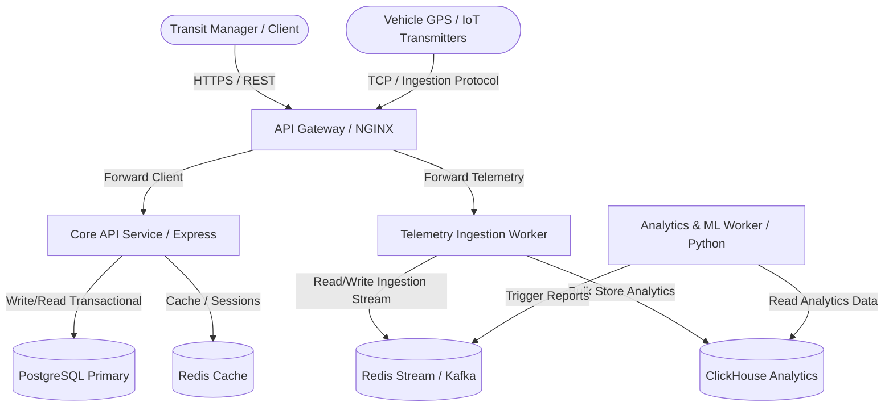

# System Architecture Overview

This document describes the high-level architecture, module boundaries, data-flows, and design constraints of the **Transit Intelligence** platform.

## Architectural Paradigm: Modular Monolith

We adopt a modular monolith architecture organized via monorepo packages. Modules are isolated via strict boundary interfaces, communicating through shared contracts and interfaces. This maximizes local iteration speed and refactoring simplicity, while laying down simple migration paths to individual microservices if traffic requirements demand it.

## System Context Diagram

## Data Ownership & Storage Separation

### Transactional Engine (PostgreSQL)

Acts as the source of truth for structured relational data:

- User accounts, organizations, permissions.
- Transit routes, schedules, static geo-fences, and agency configurations.
- Alert definitions and settings.

### Real-Time Streaming & Analytics Engine (Redis/Kafka + ClickHouse)

Telemetry data (coordinate pings, vehicle diagnostics, sensor readings) bypasses PostgreSQL.

- **Phase 1:** Telemetry is written directly to Redis Streams and periodically batched into local memory stores or a lightweight TS-indexed database.
- **Phase 2 (Scalability):** Transitioning to a dedicated **Redpanda/Kafka** queue feeding high-throughput batch writes to **ClickHouse**. ClickHouse processes large aggregated geo-queries, historical routing calculations, and analytics tables.

## Communication Mechanisms

1. **Client to System:** REST HTTP APIs (JSON structured).
2. **Internal Service to Service:** Shared internal helper functions inside the monorepo, transitioning to gRPC if boundary processes are decoupled.
3. **Asynchronous / Decoupled:** Redis Pub/Sub & Streams (Phase 1) and Kafka/Redpanda (Phase 2).
