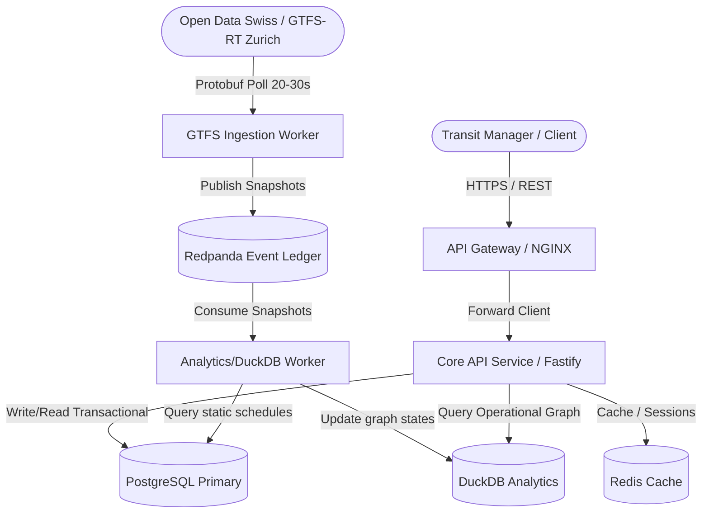

# System Architecture Overview

This document describes the high-level architecture, module boundaries, data-flows, and design constraints of the **Transit Intelligence** platform.

## Architectural Paradigm: Modular Monolith

We adopt a modular monolith architecture organized via monorepo packages. Modules are isolated via strict boundary interfaces, communicating through shared contracts and interfaces. This maximizes local iteration speed and refactoring simplicity, while laying down simple migration paths to individual microservices if traffic requirements demand it.

## System Context Diagram

## Data Ownership & Storage Separation

### Transactional & Static Engine (PostgreSQL)

Acts as the source of truth for structured relational data and static transportation assets:

- User accounts, organizations, permissions.
- Static GTFS data (stops, routes, shapes, calendar, trips).
- Alert definitions, configurations, and transactional states.

### Real-Time Streaming & Analytics Engine (Redpanda + DuckDB / ClickHouse)

Live telemetry and dynamic travel times bypass standard PostgreSQL relational writes to prevent transactional locks:

- **Phase 1 (Operational Analytics):** Live GTFS-RT snapshots (Vehicle Positions, Trip Updates) are polled every 20-30 seconds, parsed, and published to **Redpanda** as normalized snapshots. The Analytics/DuckDB workers consume these snapshots to compute a _temporally variable weighted graph_ of transit networks (where routing weights like travel time vary dynamically). DuckDB functions as an embedded column store, querying static schedules from Postgres and combining them with the live state.
- **Phase 2 (Scalability Transition):** Migrating telemetry snapshot log archiving from local DuckDB/Redpanda storage to **ClickHouse** for high-volume historical warehousing, spatial-temporal geo-queries, and ML model training.

## Communication Mechanisms

1. **Client to System:** REST HTTP APIs (JSON structured).
2. **Data Ingestion:** Protobuf-encoded HTTP GTFS-RT feed polling (20-30s intervals).
3. **Internal Storage & Processing:** In-process DuckDB queries joining PG relational tables, and **Redpanda** for decoupling ingestion from analytical calculations.
4. **Phase 2 Decoupled Communications:** National-scale message streaming and ClickHouse integrations.
