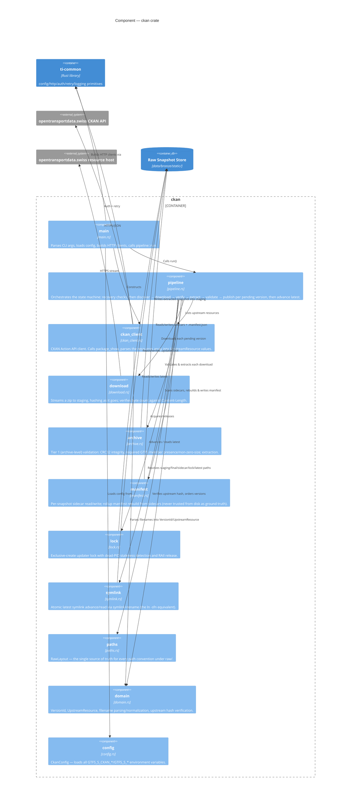

# C4 — Component: `ckan` crate

The Rust modules inside `domains/ingestion/ckan/src/` and how they collaborate. `main.rs` is a thin wrapper —
essentially all logic lives in the library (`lib.rs`) so it's exercisable from integration tests
(`domains/ingestion/ckan/tests/`).

## Notes

* `pipeline` is the only module that depends on nearly everything else — it's the state machine described in the
  design doc's pipeline overview diagram, and every arrow leaving it corresponds to one box in that diagram.
* `domain` and `paths` have no I/O of their own; they're pure logic/convention modules that everything else
  depends on, which is why they sit at the bottom with no outgoing arrows to external systems.
* `archive` writes into the *staging* extract directory, not directly into the raw store's final location — the
  atomic rename that publishes a snapshot happens in `pipeline`, not `archive` (design doc §5, steps 3–5).
