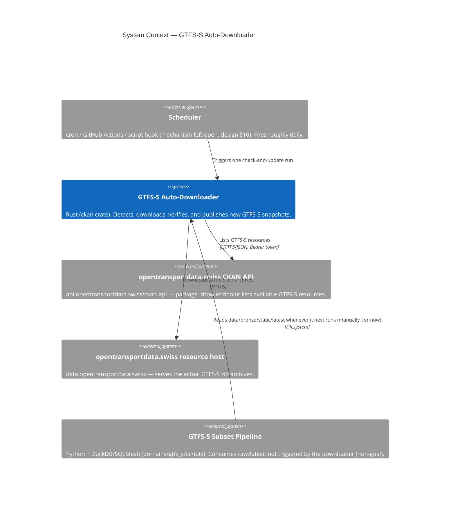

# C4 — System Context: GTFS-S Auto-Downloader

Where the downloader sits relative to opentransportdata.swiss, whatever triggers it, and the pipeline that
consumes what it publishes. Scheduling mechanism is intentionally undecided by the design (§10: cron, GitHub
Actions, or a script hook are all candidates) — shown here as a generic external trigger.

## Notes

* The downloader talks to **two distinct external hosts** under the same publisher, not one — this distinction
  matters because only the CKAN API call is authenticated (§1); the zip download itself is a plain, unauthenticated
  HTTPS GET (§3 field notes).
* The relationship to the subset pipeline is deliberately one-directional and pull-based: the downloader's job
  ends at "raw data is on disk and `latest` points at it" (design doc, Non-goals). It never calls the subset
  pipeline; the subset pipeline reads `raw/latest` whenever it happens to run next.
