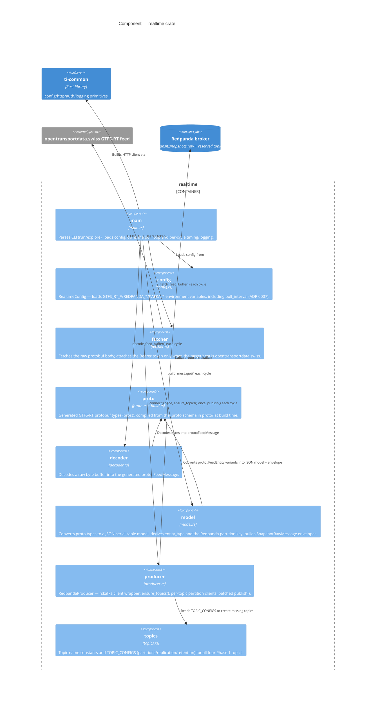

# C4 — Component: `realtime` crate

The Rust modules inside `domains/ingestion/realtime/src/` and how they collaborate. Like `ckan`, `main.rs` is a
thin CLI wrapper — the fetch/decode/model/publish stages live in the library so they're independently testable
without a live feed endpoint or Redpanda broker (`lib.rs`).

## Notes

* `proto` has no hand-written logic of its own — it's the `prost`-generated output of `build.rs` compiling the
  GTFS-RT `.proto` schema, kept as its own component because `decoder` and `model` both depend on its generated
  types directly.
* `model` is the only component that makes ingestion-specific decisions: which field wins entity-type priority
  (`vehicle` → `trip_update` → `alert` → `UNKNOWN`), what the Redpanda partition key looks like per entity type,
  and that `is_deleted` entities are dropped before publishing (they only appear in DIFFERENTIAL-mode feeds; the
  Swiss feed is FULL_DATASET). See `docs/design/gtfs-rt-domain-mapping.md`.
* `producer` is the only component that talks to Redpanda — `main` never constructs Kafka records itself, it
  just hands `producer` the `KafkaMessage` list that `model` already built.
