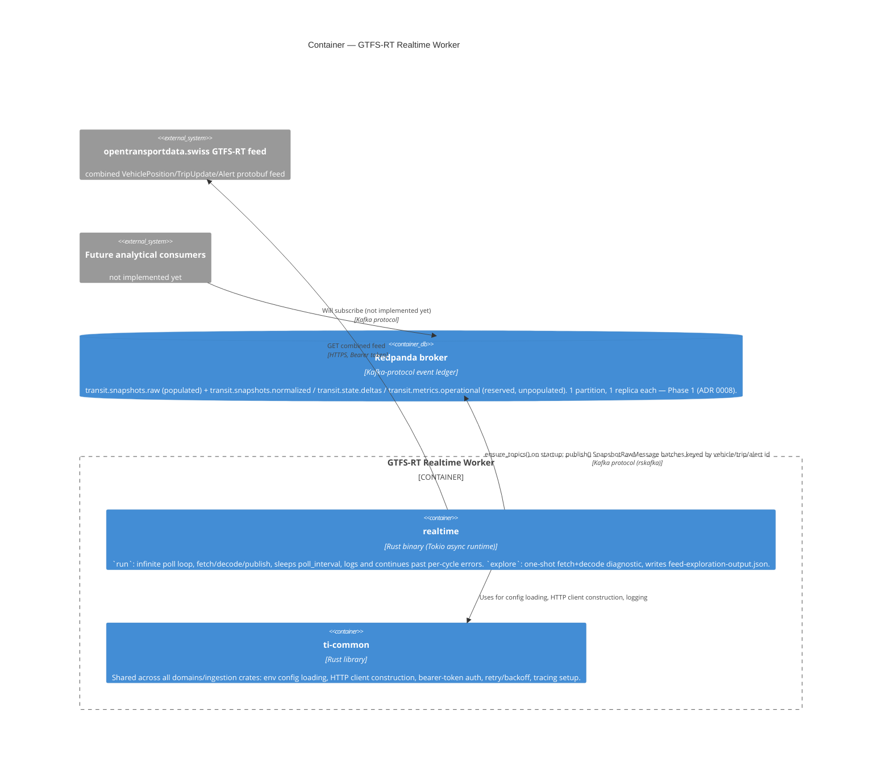

# C4 — Container: GTFS-RT Realtime Worker

Inside the "GTFS-RT Realtime Worker" system boundary: the binary itself, the shared library it's built on, and
the Redpanda broker it produces to. `domains/ingestion` is a Cargo workspace shared with `ckan` and
`service-alerts` (see the static downloader's container diagram for the workspace-sharing rationale); this
diagram shows only the members involved in realtime ingestion.

## Notes

* `realtime_bin` talks to Redpanda directly via `rskafka` — a pure-Rust Kafka client chosen specifically so the
  workspace avoids a `librdkafka`/`cmake` native toolchain dependency (`producer.rs`). No separate
  broker-client container exists; the producer logic lives inside the binary's library crate.
* `ensure_topics()` runs once at startup and is idempotent: it creates whichever of the four Phase 1 topics are
  missing, but only sets partition count and replication factor at creation time — retention (`retention.ms`)
  is still set out-of-band via `rpk topic alter-config` per the runbook, since `rskafka`'s `create_topic` doesn't
  accept broker-side config entries.
* The poll loop treats a failed cycle (feed timeout, decode error, publish failure) as non-fatal: it logs and
  sleeps to the next cycle rather than crashing the process (`main.rs::run`) — there is deliberately no
  circuit-breaker or backoff-on-failure here yet.
