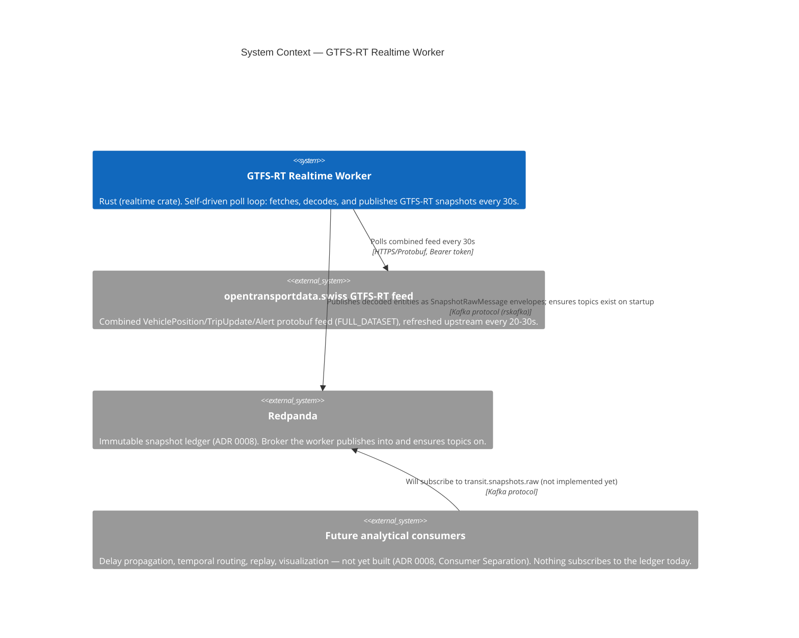

# C4 — System Context: GTFS-RT Realtime Worker

Where the realtime worker sits relative to the opentransportdata.swiss GTFS-RT feed and the Redpanda ledger it
publishes into. Unlike the static downloader, there is no external scheduler here — `realtime run` is a
long-lived process that drives its own poll loop (fetch → decode → publish → sleep) at a fixed interval
(ADR 0007: 20–30s upstream update cadence; ADR 0008: snapshot-ledger model).

## Notes

* Exactly one external upstream host appears here (`feed_host`), unlike the static downloader's two — GTFS-RT has
  no separate catalog/listing API; the feed URL itself is the resource.
* The bearer token is only attached when the request target is an `opentransportdata.swiss` host
  (`fetcher.rs`) — the same auth-scoping precaution as the static downloader, defending against token leakage
  through a redirect to a third party.
* `future_consumers` is drawn to make an easy mistake visible: the ledger being populated does **not** mean
  anything downstream exists yet. Only `transit.snapshots.raw` has a producer; `transit.snapshots.normalized`,
  `transit.state.deltas`, and `transit.metrics.operational` are reserved topic names with no writer or reader
  (`docs/design/redpanda-topic-configuration.md`).
