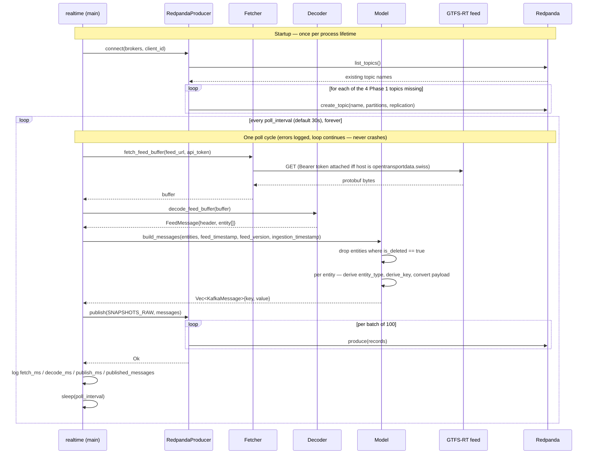

# C4 — Dynamic: One Poll Cycle

Mermaid has no native C4 "Dynamic" diagram type, so this is a sequence diagram — the standard stand-in for a C4
dynamic view. It traces `realtime run`'s startup plus one iteration of its poll loop, in the order the code
actually executes (`main.rs::run` / `main.rs::poll_and_publish`).

## Notes

* The startup topic-creation block runs exactly once, before the loop starts — every subsequent cycle assumes
  the topics already exist and goes straight to fetch/decode/publish.
* A failure at any step inside `poll_and_publish` (feed timeout, malformed protobuf, broker unreachable) is
  logged and the loop proceeds to `sleep` and the next cycle — there's no retry-within-a-cycle and no
  backoff-on-repeated-failure; the next scheduled poll is the retry.
* `feed_timestamp` (from the feed provider's header) and `ingestion_timestamp` (sampled once per cycle, not once
  per entity) are both attached to every message in the batch — this is what lets a downstream consumer measure
  provider-to-ledger latency later, per `docs/design/redpanda-topic-configuration.md`.
* `derive_key` is what actually determines Redpanda partition-key locality per entity: `vehicle.<id>` for
  positions, `trip.<id>` for trip updates, `alert.<sha256[0:12]>` for alerts (whose upstream ids aren't
  guaranteed stable) — all moot for ordering today since every topic has exactly 1 partition (ADR 0008 defers
  partitioning until replay patterns are validated).
