# C4 — Component: `ckan` crate

The Rust modules inside `domains/ingestion/extract/ckan/src/` and how they collaborate. `main.rs` is a thin
wrapper — essentially all logic lives in the library (`lib.rs`) so it's exercisable from integration tests
(`domains/ingestion/extract/ckan/tests/`).

Grouped into four boundaries, top to bottom, matching the actual call depth: the entrypoint, the run-level
orchestration it drives, the per-version processing that orchestration schedules, and the durable-state/convention
modules everything above reads or writes but that have no orchestration logic of their own.

```mermaid
C4Component
    title Component — ckan crate

    Container_Boundary(ckan_bin, "ckan") {
        Boundary(entry, "Entrypoint") {
            Component(main, "main", "main.rs", "Parses CLI args, loads config, starts observability, builds HTTP clients, calls pipeline::run.")
        }

        Boundary(orchestration, "Run-Level Orchestration") {
            Component(pipeline, "pipeline", "pipeline.rs", "One invocation: lock, startup recovery checks, discover, reconcile, run the bounded queue to drain every eligible version, then advance latest.")
            Component(reconcile, "reconcile", "reconcile.rs", "Pure function: upstream discovery + durable work state + installed snapshots -> what actually needs to happen this run. No I/O.")
            Component(queue, "queue", "queue.rs", "Generic bounded work queue: a fixed worker pool draining a capacity-limited channel. Domain-blind — knows nothing about GTFS.")
            Component(telemetry, "telemetry", "telemetry.rs", "Run-level OpenTelemetry metrics: counts, queue-wait/duration histograms, peak-concurrency gauges.")
        }

        Boundary(perversion, "Per-Version Processing (one queue worker)") {
            Component(snapshot, "snapshot", "snapshot.rs", "One version, claim through complete: inspects staging for resumable progress, then runs only the stages still needed.")
            Component(concurrency, "concurrency", "concurrency.rs", "Two resource-specific permit pools (download, processing) independent of the worker-pool size; releases via RAII.")
            Component(download, "download", "download.rs", "Streams a zip to staging, hashing as it goes; verifies byte count against Content-Length.")
            Component(archive, "archive", "archive.rs", "Tier 1 validation: CRC32 integrity, required-member presence/size; extraction to CSV staging.")
            Component(parquet_convert, "parquet_convert", "parquet_convert.rs", "Converts every extracted *.txt member to a same-named *.parquet file (all columns as Utf8).")
        }

        Boundary(state, "Durable State, Supporting I/O & Conventions") {
            Component(work_state, "work_state", "work_state.rs", "Per-version FSM (DISCOVERED/QUEUED/RUNNING/PUBLISHED/FAILED); read/write of .work/<version>.json.")
            Component(manifest, "manifest", "manifest.rs", "Per-snapshot sidecar read/write; rollup manifest rebuild from sidecars (never trusted from disk as ground truth).")
            Component(ckan_client, "ckan_client", "ckan_client.rs", "CKAN Action API client. Calls package_show, parses the resources array into UpstreamResource values.")
            Component(lock, "lock", "lock.rs", "Exclusive-create updater lock with dead-PID staleness detection and RAII release.")
            Component(symlink, "symlink", "symlink.rs", "Atomic latest symlink advance/read via symlink+rename (the ln -sfn equivalent).")
            Component(domain, "domain", "domain.rs", "VersionId, UpstreamResource, filename parsing/normalization, upstream hash verification. No I/O.")
            Component(paths, "paths", "paths.rs", "RawLayout — the single source of truth for every path convention under raw/. No I/O.")
            Component(config, "config", "config.rs", "CkanConfig — loads all GTFS_S_CKAN_*/GTFS_S_* environment variables.")
        }
    }

    Container(ti_common, "ti-common", "Rust library", "config/http/auth/retry/observability primitives")
    System_Ext(ckan_api, "opentransportdata.swiss CKAN API", "")
    System_Ext(resource_host, "opentransportdata.swiss resource host", "")
    ContainerDb(raw_store, "Raw Snapshot Store", "data/bronze/static/", "Snapshots + sidecars + manifest + latest + .work/ + .staging/")

    Rel(main, config, "Loads config from")
    Rel(main, ti_common, "Starts observability; builds HTTP clients via")
    Rel(main, ckan_client, "Constructs")
    Rel(main, pipeline, "Calls run()")

    Rel(pipeline, lock, "Acquires/releases")
    Rel(pipeline, manifest, "Scans sidecars; rebuilds & writes manifest")
    Rel(pipeline, symlink, "Verifies & advances latest")
    Rel(pipeline, ckan_client, "Lists upstream resources")
    Rel(pipeline, work_state, "Scans durable state")
    Rel(pipeline, reconcile, "Reconciles into eligible work")
    Rel(pipeline, queue, "Spawns worker pool; enqueues eligible versions")
    Rel(pipeline, telemetry, "Records run-level counts")
    Rel(reconcile, work_state, "Reads/decides transitions over")

    Rel(queue, snapshot, "Each worker runs, per version")

    Rel(snapshot, work_state, "Claim / publish / fail transitions")
    Rel(snapshot, concurrency, "Acquires download / processing permits")
    Rel(snapshot, download, "Download stage")
    Rel(snapshot, archive, "Extract + validate stage")
    Rel(snapshot, parquet_convert, "Convert stage")
    Rel(snapshot, manifest, "Writes sidecar on publish")
    Rel(concurrency, telemetry, "Records peak concurrency reached")

    Rel(ckan_client, domain, "Parses filenames into VersionId/UpstreamResource")
    Rel(ckan_client, ti_common, "Auth + retry")
    Rel(ckan_client, ckan_api, "HTTPS/JSON")
    Rel(download, resource_host, "HTTPS stream")

    Rel(work_state, raw_store, "Reads/writes .work/<version>.json")
    Rel(lock, raw_store, "Reads/writes .updater.lock")
    Rel(manifest, raw_store, "Reads/writes sidecars + .manifest.json")
    Rel(symlink, raw_store, "Reads/writes latest")
    Rel(archive, raw_store, "Writes extracted CSVs into CSV staging only")
    Rel(parquet_convert, raw_store, "Writes converted Parquet into Parquet staging only")
```

## Notes

* **Read the four boundaries as call depth, top to bottom.** `main` calls into Run-Level Orchestration exactly
  once per invocation; Orchestration's `queue` calls into Per-Version Processing once per eligible version,
  concurrently, bounded by the worker pool; everything in Per-Version Processing reads or writes Durable State,
  Supporting I/O & Conventions, but nothing in that bottom boundary calls back upward. There are no arrows pointing
  from a lower boundary to a higher one — that's what keeps this readable despite the module count.
* `queue` is generic and domain-blind by design (`ckan::queue`'s own module doc comment) — the single arrow into
  `snapshot` represents "the worker closure `pipeline` gives it happens to call `snapshot::process_snapshot`",
  not a real dependency `queue` has on GTFS logic.
* `snapshot` is the per-version state machine described in DD-001's Snapshot Processing Workflow — every arrow
  leaving it corresponds to one stage in that diagram (Download / Extract+Validate / Convert), plus the
  Claim/Complete transitions against `work_state` that bracket them.
* `domain`, `paths`, and `config` have no I/O of their own — pure logic/convention modules everything above reads
  from, which is why they sit at the bottom of their boundary with no outgoing arrows to `raw_store` or any
  external system.
* `archive` writes into the *CSV staging* extract directory, and `parquet_convert` writes into a *separate* Parquet
  staging directory — neither writes directly into the raw store's final location. The atomic rename that publishes
  a snapshot happens in `snapshot`, not in either of these modules — that single `snapshot -> manifest` arrow
  ("Writes sidecar on publish") is the only point where Per-Version Processing actually finalizes something in the
  raw store.
* `telemetry` is drawn as receiving from `pipeline` and `concurrency` rather than reaching into them — every span
  and metric instrument is created and passed inward or recorded at the point of use, never pulled from a global
  registry by business logic (see DD-001's Observability Workflow).
