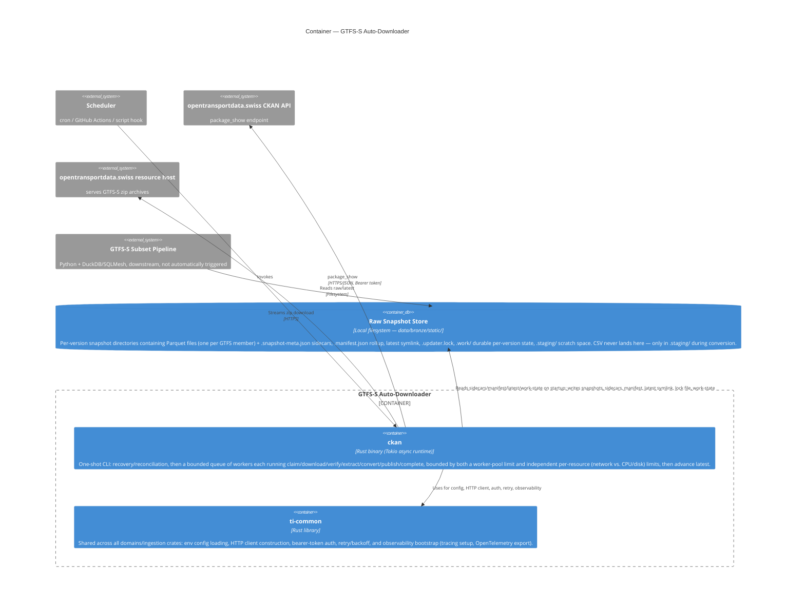

# C4 — Container: GTFS-S Auto-Downloader

Inside the "GTFS-S Auto-Downloader" system boundary: the binary itself, the shared library it's built on, and the
on-disk store it reads and writes. `domains/ingestion` is a Cargo workspace shared with `realtime` and
`service-alerts` (see the design doc's "Language & tooling boundary" section); this diagram shows only the
members involved in static ingestion.

## Notes

* `ti-common` is a plain library dependency, not a separate running process — it's shown as its own container
  because it's a distinct, independently-versioned unit of code shared with `realtime`/`service-alerts`, not
  because it runs standalone.
* The Raw Snapshot Store is filesystem, not a database, but is modelled as a `ContainerDb` because it plays the
  same architectural role here: it's the durable state the system reads on startup and writes as its output. Per
  the design doc, the filesystem (specifically the sidecars) is authoritative for what's *installed* — the manifest
  is a derived, rebuildable cache over it, never the other way around. `.work/` is a second, independent durable
  record — of what's *supposed to happen* to each version — that the filesystem's installed-state can override but
  never the reverse (see [DD-001 §Durable Work State & Reconciliation](../../design/DD-001-gtfs-static-downloader.md#durable-work-state--reconciliation)).
* This container-level view is deliberately unchanged in shape from V1: reconciliation, the work queue, resource
  permits, and observability are all internal to how `ckan_bin` does its job, not new containers or new external
  dependencies. See [static-component.md](static-component.md) for where that internal structure actually lives.
