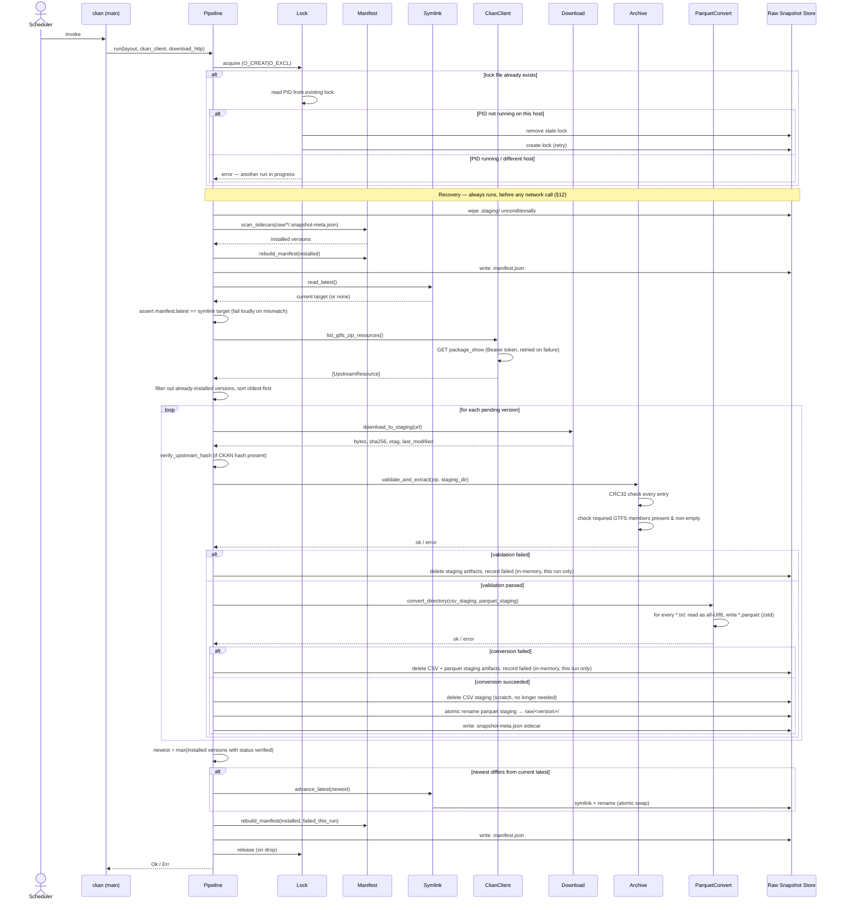

# C4 — Dynamic: One Check-and-Update Run

Mermaid has no native C4 "Dynamic" diagram type, so this is a sequence diagram — the standard stand-in for a C4
dynamic view. It traces a single invocation of `ckan::pipeline::run`, in the order the code actually executes,
including the recovery steps the design doc requires to run *before* any network call (§12).

## Notes

* The lock-staleness branch and the manifest-rebuild-and-verify block both run **every** invocation, not just
  after a crash — this is what makes the design self-healing rather than needing a special "recovery mode"
  (design doc §12: "on every run, before touching the network, clean staging, reconcile the manifest against the
  sidecars, and verify `latest` agrees with the manifest").
* The per-version loop is sequential in the current implementation (correctness/simplicity favored over
  throughput, matching the "performance is not a concern" priority) — a failure on one version doesn't abort the
  run; it's recorded and the loop continues to the next version.
* `latest` only ever advances forward, and only after the loop finishes examining every pending version — never
  mid-loop and never backwards (design doc §7).
