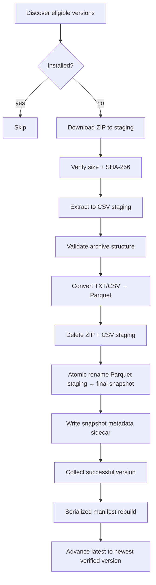

# DD-001: GTFS Static Auto-Downloader

## Overview

The Swiss nationwide GTFS Static (GTFS-S / Fahrplan) feed is published by `opentransportdata.swiss` roughly twice a week. The downloader turns that externally published feed into an inspectable, versioned local snapshot store under `data/bronze/static/`, with a stable `latest` pointer for downstream consumers.

The implemented system lives in `domains/ingestion/extract/ckan/` as the `ckan` crate in the ingestion Cargo workspace. It owns source discovery, downloading, archive verification, extraction, archive-level GTFS structure checks, CSV-to-Parquet conversion, atomic publication, snapshot metadata, concurrency control, and recovery.

The downloader deliberately stops at producing a structurally sound, durable Parquet snapshot. Semantic/content-level transformation and downstream operational modelling are separate concerns and are not part of this document.

For the container/component structure of the wider ingestion domain, see the relevant C4 architecture documentation. For the rationale behind individual architectural choices, see the related ADRs listed under [See Also](#see-also).

---

## Design Goals

- **Deterministic version discovery.** Discover GTFS-S snapshots from the publisher's CKAN API rather than scraping the dataset HTML page, normalize publisher filenames into a stable `YYYYMMDD` version identifier, and process every eligible version that is not already installed.

- **Filesystem-first durability.** The filesystem is the source of truth for installed snapshots. Each successfully published snapshot carries its own immutable metadata sidecar; the roll-up manifest is only a rebuildable index.

- **No partial publication.** A snapshot is never visible at its final path until extraction, archive validation, and Parquet conversion have completed successfully. Readers must see either the previous complete snapshot or the new complete snapshot.

- **Monotonic `latest`.** `latest` advances only to the newest successfully verified snapshot. A failed or incomplete upstream version must never replace a known-good version.

- **Idempotent execution.** Re-running the downloader must not duplicate successfully installed snapshots, must safely retry failed versions, and must recover from interrupted runs without manual reconstruction of state.

- **Bounded concurrency.** Independently discovered GTFS versions may be processed concurrently, but total in-flight work is bounded to control network and staging-disk usage.

- **Rebuildability.** Losing a derived manifest must not lose the history represented by the snapshot sidecars. Staging state, manifests, and locks must all have deterministic recovery behavior.

- **Canonical Parquet storage.** CSV files extracted from the upstream ZIP are treated as transient staging data. Persisted snapshots contain Parquet only.

---

## Non-Goals

- Content-level GTFS semantic validation, including detailed column semantics, referential-integrity validation, row-count expectations, or downstream business rules. The downloader performs archive-level and structural checks only.

- Building the Zurich operational subset or other derived datasets.

- Transforming the nationwide feed into the platform's operational/network model.

- Automatically triggering downstream transformation or analytical jobs when a new snapshot is published.

- Diffing the contents of one GTFS snapshot against another.

- Deleting or pruning retained snapshots. Every successfully published snapshot is retained indefinitely by this component.

- Historical backfill of the entire publisher catalog. Discovery is bounded by `GTFS_S_CUTOFF_VERSION` so the first automated run does not implicitly become an unbounded historical download.

---

## Version Discovery Workflow

Version discovery is performed against the publisher's CKAN Action API:

```text
GET {GTFS_S_CKAN_API_URL}/action/package_show?id={GTFS_S_CKAN_DATASET_ID}
```

The implementation uses:

```text
GTFS_S_CKAN_API_URL=https://api.opentransportdata.swiss/ckan-api
GTFS_S_CKAN_DATASET_ID=timetable-2026-gtfs2020
```

Authentication is supplied with:

```http
Authorization: Bearer <GTFS_S_CKAN_API_TOKEN>
```

The publisher's `resources` response is inspected for ZIP resources. The version identifier is derived from the final filename component of the resource URL and normalized to `YYYYMMDD`. This avoids coupling version identity to historical filename formatting.

The discovery result is a set of:

```text
(version_id, download_url)
```

pairs.

A version is eligible for processing when:

1. It is at or newer than `GTFS_S_CUTOFF_VERSION`.
2. It is not already installed according to the filesystem-first source-of-truth rule.
3. It represents a publisher ZIP resource.

Eligible versions are processed oldest-first so that a delayed run naturally reconstructs the local history in chronological order.

### Filesystem-First Installation Check

A version is installed only when both of the following exist:

```text
data/bronze/static/<version>/
data/bronze/static/<version>/.snapshot-meta.json
```

The manifest is not consulted as the authority for this decision.

The roll-up manifest can therefore be deleted or regenerated without changing the meaning of the installed snapshot store.

---

## Snapshot Processing Workflow

Every eligible version follows the same processing pipeline.



Each version owns its own staging paths. No version shares a staging directory, temporary archive, or sidecar with another version.

### Download

The ZIP archive is streamed into:

```text
data/bronze/static/.staging/
```

The archive is written with a temporary `.part` suffix until the download completes.

### Archive Verification

Before extraction, the downloader verifies:

- downloaded byte count against `Content-Length` when available;
- SHA-256 of the downloaded archive;
- publisher-supplied `hash` when it is plausibly a SHA-256 value.

Verification occurs before extraction so corrupted or truncated downloads do not consume CPU and disk resources during decompression.

### Extraction

The ZIP is extracted into a version-specific CSV staging directory. No extracted file is written directly into the final snapshot directory.

### Archive-Level GTFS Validation

The downloader validates archive structure without interpreting GTFS business semantics.

It verifies that:

- the ZIP opens successfully and its entries pass archive-level integrity checks;
- required GTFS members exist;
- required members are non-empty both in archive metadata and after extraction.

The required members are:

```text
stops.txt
trips.txt
routes.txt
stop_times.txt
calendar_dates.txt
```

`agency.txt` and `calendar.txt` are retained when present.

A successful validation means:

> the publisher archive is intact and shaped like a GTFS feed.

It does not mean:

> the GTFS data is semantically valid for every downstream consumer.

### CSV-to-Parquet Conversion

Every extracted `.txt` member is converted to a same-named Parquet file.

For example:

```text
stops.txt         → stops.parquet
trips.txt         → trips.parquet
stop_times.txt    → stop_times.parquet
```

Conversion is deliberately performed in a separate Parquet staging directory. The final snapshot directory is untouched until conversion succeeds.

Columns are preserved as strings during this conversion. Type interpretation belongs to downstream consumers rather than to the byte-format conversion step.

All `.txt` files present in the source archive are converted, including optional GTFS members that are not required for the archive-level validation gate.

After conversion succeeds:

- the ZIP staging file is deleted;
- the CSV staging directory is deleted;
- the Parquet staging directory becomes the durable snapshot through an atomic rename.

---

## Snapshot Publication Workflow

The final publication sequence is:

```text
Parquet staging
    ↓
atomic rename
    ↓
<version>/
    ↓
write .snapshot-meta.json
    ↓
rebuild .manifest.json
    ↓
advance latest
```

### Snapshot Directory

A successfully published version looks like:

```text
data/bronze/static/
├── gtfs_fp2026_20260805/
│   ├── stops.parquet
│   ├── trips.parquet
│   ├── routes.parquet
│   ├── stop_times.parquet
│   └── .snapshot-meta.json
├── gtfs_fp2026_20260812/
│   └── ...
├── .manifest.json
└── latest -> gtfs_fp2026_20260812
```

### Snapshot Metadata

Each snapshot has an immutable sidecar:

```json
{
  "version": "20260805",
  "source_url": "https://...",
  "downloaded_at": "2026-08-06T04:00:12Z",
  "archive_size_bytes": 812345123,
  "archive_sha256": "...",
  "publisher_last_modified": "2026-08-05T22:03:00Z",
  "etag": "\"a1b2c3\"",
  "extract_path": "data/bronze/static/gtfs_fp2026_20260805",
  "status": "verified"
}
```

The sidecar records the durable identity and provenance of the snapshot. It is written only after the snapshot directory is fully materialized.

### Manifest

`.manifest.json` is a derived roll-up index over all snapshot sidecars.

It contains the current `latest` version and a compact status/path entry for each known version.

The manifest is never authoritative. If it is missing, corrupted, or stale, it is regenerated by scanning the sidecars.

### Status Model

| Status | Meaning |
| --- | --- |
| `verified` | Snapshot is fully downloaded, converted, structurally validated, and durably present on disk. Eligible to become `latest`. |
| `superseded` | Snapshot was previously verified but is no longer the newest accepted snapshot. It remains retained on disk. |
| `failed` | Processing was attempted and rejected. No final snapshot directory is created for the failed version. |

`latest` is not a persisted per-version status. Currentness is represented by the `latest` symlink itself.

### `latest` Pointer

`latest` points at the highest successfully verified version.

The pointer is monotonic:

```text
latest(N) → latest(N+1)
```

never:

```text
latest(N) → latest(N-1)
```

The final symlink update is serialized after all concurrent version workers complete, and the target is selected using the maximum verified version rather than task completion order.

On POSIX filesystems, the symlink replacement is performed atomically:

```bash
ln -sfn gtfs_fp2026_20260812 data/bronze/static/latest
```

Readers therefore observe either the previous complete snapshot or the new complete snapshot.

---

## Concurrent Version Processing Workflow

Discovered versions are independent work items. They do not share:

- staging directories;
- final snapshot paths;
- sidecar files;
- per-version state.

The updater therefore processes multiple versions concurrently behind a single semaphore.

```text
ckan invocation
    │
    ├── acquire updater lock
    │
    ├── discover versions
    │
    ├── bounded semaphore
    │
    ├── process version A ──┐
    ├── process version B ──┤
    ├── process version C ──┤
    │                       │
    └── join all tasks ─────┘
            │
            ├── rebuild manifest
            ├── advance latest
            └── release lock
```

The current implementation uses:

```text
Arc<Semaphore>
tokio::task::JoinSet
tokio::task::spawn_blocking
```

`GTFS_S_MAX_CONCURRENT_VERSIONS` controls the maximum number of simultaneously in-flight versions and defaults to:

```text
min(4, available_parallelism)
```

The single version-level semaphore is intentional. A separate download pool, extraction pool, and conversion pool would introduce cross-pool coordination and partial-stage failure handling without demonstrated benefit for the current workload.

The download stage is I/O-bound while extraction and Parquet conversion are CPU/disk-heavy. `spawn_blocking` keeps those synchronous stages off Tokio's async executor threads so other version downloads can continue.

Only post-join operations are serialized:

- collecting successful results;
- determining the maximum verified version;
- advancing `latest`;
- rebuilding and writing the manifest.

Because `latest` is determined from the maximum verified version, task completion order has no effect on correctness.

The implementation benchmarked roughly a 2.0× speedup for four synthetic versions with a concurrency cap of four versus fully sequential processing in a debug build. Production archives are substantially larger and download-heavy, so actual gains are expected to depend on network and staging-disk throughput.

---

## Scheduling Workflow

The publisher updates the feed roughly twice a week, without a guaranteed time of day and with no publication on Swiss public holidays.

The updater therefore checks once per day.

A daily check is sufficient because the cost of an unchanged run is small: version discovery requires a single CKAN API request followed by filesystem comparison.

The exact scheduler mechanism is intentionally outside this design. The downloader is designed to be callable safely by any external scheduler that can invoke the `ckan` binary.

---

## Locking Workflow

Only one updater invocation may perform discovery, processing, publication, and manifest updates at a time.

The updater uses:

```text
data/bronze/static/.updater.lock
```

The protocol is:

1. Atomically create the lock with exclusive creation semantics.
2. Record the current PID and start timestamp.
3. If the lock already exists, determine whether its recorded process is still running on the same host.
4. If the process is dead, treat the lock as stale and retry acquisition once.
5. If another run is active, exit cleanly.
6. Release the lock in `finally`/`defer` regardless of success or handled failure.

The lock protects the global updater workflow. It does not replace per-version isolation or atomic filesystem publication.

---

## Recovery Workflow

Recovery is based on a simple invariant:

> intermediate filesystem state is disposable; published snapshot state is durable.

On startup, the updater reconciles state before contacting the upstream API.

### Staging Artifacts

Anything under:

```text
data/bronze/static/.staging/
```

is disposable.

If a previous process left behind:

```text
*.zip.part
<version>/
<version>.parquet/
```

the next run removes the incomplete staging artifacts before continuing.

### Stale Lock

If `.updater.lock` refers to a dead local process, it is removed and acquisition is retried.

### Snapshot Without Sidecar

A final-version directory without `.snapshot-meta.json` is not treated as installed.

This state should never be produced by the normal pipeline, so it is also evidence that the filesystem was modified outside the downloader. The updater may safely reprocess the version rather than trusting the incomplete directory.

### Missing or Corrupt Manifest

The manifest is regenerated from snapshot sidecars.

Deleting `.manifest.json` therefore does not delete knowledge of installed snapshots.

### Invalid `latest`

If `latest` points at a snapshot whose sidecar is not `verified`, the updater treats that as an invariant violation and fails loudly rather than guessing which state is authoritative.

### Crash During Processing

A process killed during download, extraction, or conversion leaves only disposable staging state. Previously published snapshots are not modified.

This gives the system a clean recovery boundary:

```text
published snapshot
        ↑
   atomic boundary
        ↑
 disposable staging
```

---

## Failure Modes

| Scenario | Handling |
| --- | --- |
| CKAN API unavailable | Run fails without changing existing snapshots, manifest, or `latest`. |
| Download truncated or corrupt | Discard staging; mark processing as failed; `latest` does not move. |
| Archive fails integrity checks | Discard staging; version is not published. |
| Required GTFS member missing/empty | Reject snapshot before publication. |
| CSV-to-Parquet conversion fails | Discard both CSV and Parquet staging; do not create final snapshot. |
| Concurrent updater invocation | Existing run owns `.updater.lock`; second run exits cleanly. |
| Process killed mid-run | Staging is disposable; stale lock and manifest are recoverable. |
| Manifest missing/corrupt | Rebuild from snapshot sidecars. |
| `latest` invariant violated | Fail loudly rather than silently repairing state. |
| Disk pressure from retained snapshots | Retention remains intentional; physical storage lifecycle is handled outside the downloader. |

---

## Retention

Every successfully published snapshot is retained indefinitely.

The downloader deletes temporary ZIP and CSV staging artifacts after successful Parquet conversion, but never deletes a durable `verified` or `superseded` snapshot.

The canonical retained format is therefore:

```text
Parquet
```

not the much larger source CSV representation.

If storage economics eventually require lifecycle management, snapshots may be moved to cheaper storage by infrastructure policy without changing the downloader's logical contract.

---

## Consumer Responsibilities

Downstream consumers must treat:

```text
data/bronze/static/latest
```

as the canonical entry point to the newest accepted GTFS-S snapshot once consumer cutover is complete.

Consumers must expect Parquet files:

```text
stops.parquet
trips.parquet
routes.parquet
stop_times.parquet
...
```

They must not depend on the transient CSV extraction layout.

The existing subset consumer currently points at the older manual snapshot location and therefore requires a separate cutover to:

```text
PROJECT_ROOT / "data" / "bronze" / "static" / "latest"
```

That cutover is deliberately outside the downloader implementation itself.

---

## User Responsibilities

The downloader is an infrastructure component and does not require a human in its normal execution path.

An operator is responsible only for:

- providing valid CKAN API credentials through the configured environment;
- ensuring the updater has write access to the bronze data location;
- ensuring sufficient staging disk space for the configured concurrency;
- inspecting logs and recovery failures when the updater exits non-zero;
- changing `GTFS_S_MAX_CONCURRENT_VERSIONS` when the host's network or disk capacity requires tighter bounds.

Manual manipulation of snapshot directories, sidecars, manifests, or `latest` is not part of normal operation.

---

## Downloader Responsibilities

The `ckan` crate under `domains/ingestion/extract/ckan/` is responsible for:

- discovering upstream GTFS-S versions;
- authenticating to the CKAN API;
- streaming and checksumming archives;
- validating archive integrity;
- extracting GTFS members into staging;
- validating required archive structure;
- converting extracted GTFS text files to Parquet;
- atomically publishing completed snapshots;
- writing immutable snapshot metadata;
- maintaining the rebuildable manifest;
- advancing `latest` monotonically;
- enforcing the updater lock;
- cleaning stale staging state;
- recovering from interrupted execution;
- processing independent versions with bounded concurrency.

The downloader never owns downstream semantic interpretation of GTFS data.

---

## Data Storage Responsibilities

The bronze storage location is:

```text
data/bronze/static/
```

It is intentionally outside the source-code domain tree because the retained GTFS snapshots are data artifacts rather than source code.

The storage contract is:

```text
data/bronze/static/
├── <snapshot-version>/
│   ├── *.parquet
│   └── .snapshot-meta.json
├── .manifest.json
├── .updater.lock
└── latest -> <snapshot-version>
```

The filesystem is authoritative.

The manifest is derived.

The sidecar is the durable per-snapshot record.

The `latest` symlink is the durable current-version pointer.

---

## See Also

- [Runbook: Downloading the Swiss GTFS Static Timetable](../runbooks/gtfs-static-timetable-download.md) — the manual process this component replaces and the upstream feed reference.
- [ADR 0011 — GTFS Static Preprocessing and Zurich Operational Subset Strategy](../adr/0011-gtfs-static-preprocessing-and-zurich-subset-strategy.md) — defines the downstream operational subset and its processing assumptions.
- [C4 Model — Ingestion](../architecture/c4/ingestion.md) — the container/component structure surrounding the `ckan` crate.
- [DD-002: GTFS Static Transformation](./DD-002-gtfs-static-transformation.md) — downstream transformation of published Parquet snapshots, once documented.
- [ADR: Rust for Systems-Oriented Ingestion](../architecture/adr/ADR-XXX-rust-for-systems-oriented-ingestion.md) — formalizes Rust's role in ingestion infrastructure if/when that governance decision is recorded separately.

---

## Status

**Implemented.**

The `ckan` crate currently implements:

- CKAN-based version discovery;
- authenticated source access;
- archive verification;
- archive-level GTFS structural validation;
- CSV-to-Parquet conversion;
- atomic snapshot publication;
- snapshot sidecars and manifest rebuilding;
- monotonic `latest` management;
- updater locking and stale-lock recovery;
- crash-safe staging cleanup;
- bounded version-level concurrency using `Arc<Semaphore>` and `JoinSet`;
- `spawn_blocking` for extraction and Parquet conversion.

The design intentionally documents the system as it exists today. Downstream transformation, semantic validation, and consumer cutover are separate concerns and are not represented as implemented behavior here.
