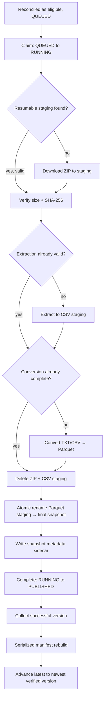

# DD-001: GTFS Static Auto-Downloader

## Overview

The Swiss nationwide GTFS Static (GTFS-S / Fahrplan) feed is published by `opentransportdata.swiss` roughly twice a week. The downloader turns that externally published feed into an inspectable, versioned local snapshot store under `data/bronze/static/`, with a stable `latest` pointer for downstream consumers.

The implemented system lives in `domains/ingestion/extract/ckan/` as the `ckan` crate in the ingestion Cargo workspace. It owns source discovery, reconciliation, downloading, archive verification, extraction, archive-level GTFS structure checks, CSV-to-Parquet conversion, atomic publication, snapshot metadata, durable per-version state, bounded and resource-specific concurrency control, stage-aware crash recovery, and observability.

The downloader deliberately stops at producing a structurally sound, durable Parquet snapshot. Semantic/content-level transformation and downstream operational modelling are separate concerns and are not part of this document.

For the container/component structure of the wider ingestion domain, see the relevant C4 architecture documentation. For the rationale behind individual architectural choices, see the related ADRs listed under [See Also](#see-also).

**This document describes V2** — the architecture as it stands after a 12-phase incremental evolution from a simpler V1 (single semaphore, no durable per-version state, wholesale staging wipe on every restart, no observability). V2 is local-first and single-process by design, not a stepping stone left half-finished toward a distributed system; that direction was deliberately considered and explicitly not taken (see [Design Evolution](#design-evolution)). The full phase-by-phase record — what was tried, what was measured, what was reversed — lives in [IMPL-001](../implementation/IMPL-001-gtfs-static-downloader-V1.md); this document states only the current, settled design.

---

## Design Goals

- **Deterministic version discovery.** Discover GTFS-S snapshots from the publisher's CKAN API rather than scraping the dataset HTML page, normalize publisher filenames into a stable `YYYYMMDD` version identifier, and process every eligible version that is not already installed.

- **Filesystem-first durability.** The filesystem is the source of truth for installed snapshots. Each successfully published snapshot carries its own immutable metadata sidecar; the roll-up manifest is only a rebuildable index.

- **No partial publication.** A snapshot is never visible at its final path until extraction, archive validation, and Parquet conversion have completed successfully. Readers must see either the previous complete snapshot or the new complete snapshot.

- **Monotonic `latest`.** `latest` advances only to the newest successfully verified snapshot. A failed or incomplete upstream version must never replace a known-good version.

- **Idempotent execution.** Re-running the downloader must not duplicate successfully installed snapshots, must safely retry failed versions, and must recover from interrupted runs without manual reconstruction of state.

- **Bounded concurrency.** Independently discovered GTFS versions may be processed concurrently, but total in-flight work is bounded to control network and staging-disk usage.

- **Rebuildability.** Losing a derived manifest must not lose the history represented by the snapshot sidecars. Staging state, manifests, and locks must all have deterministic recovery behavior.

- **Canonical Parquet storage.** CSV files extracted from the upstream ZIP are treated as transient staging data. Persisted snapshots contain Parquet only.

- **Durable, explainable per-version state.** Every discovered version has an explicit, persisted state (`DISCOVERED → QUEUED → RUNNING → PUBLISHED`/`FAILED`) independent of any one process's memory, so "what happened to this version" is always answerable from disk, not inferred from logs or reconstructed from a crash.

- **Resumable, not just recoverable, processing.** An interrupted version resumes from wherever it actually got to — a valid downloaded archive, a valid extraction, a complete conversion — rather than restarting every stage from scratch on every retry.

- **Observable by construction.** A run's own behavior (per-stage timing, queue wait, concurrency achieved, throughput) is answerable from what the process itself recorded, not only inferred after the fact from wall-clock and guesswork.

---

## Non-Goals

- Content-level GTFS semantic validation, including detailed column semantics, referential-integrity validation, row-count expectations, or downstream business rules. The downloader performs archive-level and structural checks only.

- Building the Zurich operational subset or other derived datasets.

- Transforming the nationwide feed into the platform's operational/network model.

- Automatically triggering downstream transformation or analytical jobs when a new snapshot is published.

- Diffing the contents of one GTFS snapshot against another.

- Deleting or pruning retained snapshots. Every successfully published snapshot is retained indefinitely by this component.

- Historical backfill of the entire publisher catalog. Discovery is bounded by `GTFS_S_CUTOFF_VERSION` so the first automated run does not implicitly become an unbounded historical download.

- Distributed execution. Per-version worker ownership, leases, a distributed queue, and multi-process orchestration were explicitly considered and explicitly not built — every reliability, concurrency, and performance question raised while building V2 was answerable inside a single local process. See [V3 Considerations](#v3-considerations) for what would need to be revisited if that changes.

---

## Version Discovery Workflow

Version discovery is performed against the publisher's CKAN Action API:

```text
GET {GTFS_S_CKAN_API_URL}/action/package_show?id={GTFS_S_CKAN_DATASET_ID}
```

The implementation uses:

```text
GTFS_S_CKAN_API_URL=https://api.opentransportdata.swiss/ckan-api
GTFS_S_CKAN_DATASET_ID=timetable-2026-gtfs2020
```

Authentication is supplied with:

```http
Authorization: Bearer <GTFS_S_CKAN_API_TOKEN>
```

The publisher's `resources` response is inspected for ZIP resources. The version identifier is derived from the final filename component of the resource URL and normalized to `YYYYMMDD`. This avoids coupling version identity to historical filename formatting.

The discovery result is a set of:

```text
(version_id, download_url)
```

pairs.

A version is eligible for processing when:

1. It is at or newer than `GTFS_S_CUTOFF_VERSION`.
2. It is not already installed according to the filesystem-first source-of-truth rule.
3. It represents a publisher ZIP resource.

Eligible versions are processed oldest-first so that a delayed run naturally reconstructs the local history in chronological order.

### Filesystem-First Installation Check

A version is installed only when both of the following exist:

```text
data/bronze/static/<version>/
data/bronze/static/<version>/.snapshot-meta.json
```

The manifest is not consulted as the authority for this decision.

The roll-up manifest can therefore be deleted or regenerated without changing the meaning of the installed snapshot store.

---

## Durable Work State & Reconciliation

Alongside the filesystem's record of what's *installed*, each discovered version has an explicit, persisted control-plane record of what *should happen to it* — a `VersionWork` entry, one JSON file per version under `data/bronze/static/.work/`, independent of any process's in-memory state.

```text
DISCOVERED
    ↓
  QUEUED
    ↓
  RUNNING
   ↙   ↘
FAILED  PUBLISHED
```

The transition graph is closed and strictly enforced: every legal move is one specific method (`queue()`, `start()`, `publish()`, `fail()`, `retry()`), and every illegal move is rejected rather than silently coerced. There is exactly one deliberate exception — `reconcile_as_published`, described below.

**Reconciliation is a pure function**, run once at the start of every invocation, before any network call: given the upstream discovery result, the durable work-state records, and the filesystem's own installed-snapshot map, it decides what actually needs to happen this run. No I/O happens inside it; every decision is testable in isolation from the real pipeline.

Reconciliation's rules, filesystem always wins:

- A version the filesystem shows as installed is forced to `PUBLISHED` regardless of what its control-plane record previously said — including bootstrapping a version that has no record at all yet (e.g. a directory installed before this component existed), and **overriding** a record that says something else (a crash between publish and the record being written). This is the one legal way to reach `PUBLISHED` outside the normal `RUNNING → PUBLISHED` transition.
- A version the control plane shows `RUNNING`, with no filesystem evidence of a live owner, is treated as abandoned by a crashed prior invocation and recovered to `QUEUED`.
- A version previously `FAILED` and still not installed is retried (`QUEUED` again).
- A version the control plane claims is `PUBLISHED`, but the filesystem disagrees, is **flagged, not auto-corrected** — surfaced as a loud divergence for investigation, consistent with this design's existing preference for failing loudly over guessing which side of an invariant is right (see `latest` below).

This durable state is what makes crash recovery, idempotent reprocessing, and "at most one worker owns a version at a time" provable rather than assumed, and is what stage-aware resume (below) and observability's per-version spans are both built on.

---

## Snapshot Processing Workflow

Every eligible version follows the same processing pipeline.



Each version owns its own staging paths. No version shares a staging directory, temporary archive, or sidecar with another version.

The `{...already valid?}`/`{...already complete?}` branches are stage-aware resume (see [Crash During Processing](#crash-during-processing)): a fresh worker inspects the filesystem for durable, trustworthy evidence of prior progress and skips exactly the stages that evidence covers — never more, never based on anything remembered from a previous process.

### Download

The ZIP archive is streamed into:

```text
data/bronze/static/.staging/
```

The archive is written with a temporary `.part` suffix until the download completes.

### Archive Verification

Before extraction, the downloader verifies:

- downloaded byte count against `Content-Length` when available;
- SHA-256 of the downloaded archive;
- publisher-supplied `hash` when it is plausibly a SHA-256 value.

Verification occurs before extraction so corrupted or truncated downloads do not consume CPU and disk resources during decompression.

### Extraction

The ZIP is extracted into a version-specific CSV staging directory. No extracted file is written directly into the final snapshot directory.

### Archive-Level GTFS Validation

The downloader validates archive structure without interpreting GTFS business semantics.

It verifies that:

- the ZIP opens successfully and its entries pass archive-level integrity checks;
- required GTFS members exist;
- required members are non-empty both in archive metadata and after extraction.

The required members are:

```text
stops.txt
trips.txt
routes.txt
stop_times.txt
calendar_dates.txt
```

`agency.txt` and `calendar.txt` are retained when present.

A successful validation means:

> the publisher archive is intact and shaped like a GTFS feed.

It does not mean:

> the GTFS data is semantically valid for every downstream consumer.

### CSV-to-Parquet Conversion

Every extracted `.txt` member is converted to a same-named Parquet file.

For example:

```text
stops.txt         → stops.parquet
trips.txt         → trips.parquet
stop_times.txt    → stop_times.parquet
```

Conversion is deliberately performed in a separate Parquet staging directory. The final snapshot directory is untouched until conversion succeeds.

Columns are preserved as strings during this conversion. Type interpretation belongs to downstream consumers rather than to the byte-format conversion step.

All `.txt` files present in the source archive are converted, including optional GTFS members that are not required for the archive-level validation gate.

After conversion succeeds:

- the ZIP staging file is deleted;
- the CSV staging directory is deleted;
- the Parquet staging directory becomes the durable snapshot through an atomic rename.

---

## Snapshot Publication Workflow

The final publication sequence is:

```text
Parquet staging
    ↓
atomic rename
    ↓
<version>/
    ↓
write .snapshot-meta.json
    ↓
rebuild .manifest.json
    ↓
advance latest
```

### Snapshot Directory

A successfully published version looks like:

```text
data/bronze/static/
├── gtfs_fp2026_20260805/
│   ├── stops.parquet
│   ├── trips.parquet
│   ├── routes.parquet
│   ├── stop_times.parquet
│   └── .snapshot-meta.json
├── gtfs_fp2026_20260812/
│   └── ...
├── .manifest.json
└── latest -> gtfs_fp2026_20260812
```

### Snapshot Metadata

Each snapshot has an immutable sidecar:

```json
{
  "version": "20260805",
  "source_url": "https://...",
  "downloaded_at": "2026-08-06T04:00:12Z",
  "archive_size_bytes": 812345123,
  "archive_sha256": "...",
  "publisher_last_modified": "2026-08-05T22:03:00Z",
  "etag": "\"a1b2c3\"",
  "extract_path": "data/bronze/static/gtfs_fp2026_20260805",
  "status": "verified"
}
```

The sidecar records the durable identity and provenance of the snapshot. It is written only after the snapshot directory is fully materialized.

### Manifest

`.manifest.json` is a derived roll-up index over all snapshot sidecars.

It contains the current `latest` version and a compact status/path entry for each known version.

The manifest is never authoritative. If it is missing, corrupted, or stale, it is regenerated by scanning the sidecars.

### Status Model

| Status | Meaning |
| --- | --- |
| `verified` | Snapshot is fully downloaded, converted, structurally validated, and durably present on disk. Eligible to become `latest`. |
| `superseded` | Snapshot was previously verified but is no longer the newest accepted snapshot. It remains retained on disk. |
| `failed` | Processing was attempted and rejected. No final snapshot directory is created for the failed version. |

`latest` is not a persisted per-version status. Currentness is represented by the `latest` symlink itself.

### `latest` Pointer

`latest` points at the highest successfully verified version.

The pointer is monotonic:

```text
latest(N) → latest(N+1)
```

never:

```text
latest(N) → latest(N-1)
```

The final symlink update is serialized after all concurrent version workers complete, and the target is selected using the maximum verified version rather than task completion order.

On POSIX filesystems, the symlink replacement is performed atomically:

```bash
ln -sfn gtfs_fp2026_20260812 data/bronze/static/latest
```

Readers therefore observe either the previous complete snapshot or the new complete snapshot.

---

## Concurrent Version Processing Workflow

Discovered versions are independent work items. They do not share:

- staging directories;
- final snapshot paths;
- sidecar files;
- per-version state.

Eligible versions flow through a **bounded local work queue** consumed by a **fixed pool of workers**, with a **second, independent layer of resource-specific limits** inside what each worker does with its slot:

```text
ckan invocation
    │
    ├── acquire updater lock
    │
    ├── discover + reconcile → eligible versions (QUEUED)
    │
    ├── bounded queue (capacity: GTFS_S_MAX_QUEUED_VERSIONS)
    │        │
    │        ▼
    ├── fixed worker pool (size: GTFS_S_MAX_CONCURRENT_VERSIONS)
    │        │
    │        ├── worker: Claim → Download → Verify → Extract → Convert → Publish → Complete
    │        │             │                    │        │
    │        │             ▼                    ▼        ▼
    │        │      download permit      processing permit (shared by Extract + Convert)
    │        │      (GTFS_S_MAX_CONCURRENT_DOWNLOADS)   (GTFS_S_MAX_CONCURRENT_PROCESSING)
    │        │
    │        └── (repeats until the queue is drained)
    │
    ├── producer (enqueuing) and result-draining run concurrently — see note below
    │
    ├── rebuild manifest
    ├── advance latest
    └── release lock
```

Four independent concurrency knobs, all defaulting to `min(4, available_parallelism)` unless configured otherwise:

| Variable | Bounds |
| --- | --- |
| `GTFS_S_MAX_CONCURRENT_VERSIONS` | How many versions may be in any stage at once (the worker pool size). |
| `GTFS_S_MAX_QUEUED_VERSIONS` | How many eligible versions may sit waiting for a worker before the producer blocks. |
| `GTFS_S_MAX_CONCURRENT_DOWNLOADS` | How many Download stages may run at once, independent of the worker pool size. |
| `GTFS_S_MAX_CONCURRENT_PROCESSING` | How many Extract-or-Convert stages may run at once (one shared pool for both), independent of the worker pool size. |

The current implementation uses:

```text
tokio::sync::mpsc  (the bounded queue itself)
tokio::sync::Semaphore  (the worker pool's fixed size, and each resource-specific permit pool)
tokio::task::JoinSet
tokio::task::spawn_blocking
```

**Why resource-specific limits, separate from the worker pool.** A version occupying a worker slot could be doing any of its stages; without a second layer, "4 versions downloading at once" and "4 versions running CPU-heavy Parquet conversion at once" would be indistinguishable, even though those put very different load on the network versus the CPU/disk. Download draws from one pool; Extract and Convert draw from a second, shared pool — both put the same kind of load (CPU + disk, not network) on the host, so splitting them further wasn't worth the added coordination.

**Why a bounded queue, not just a semaphore.** Discovery can produce more eligible work than can immediately be processed (e.g. after downtime, or on first run against a bounded historical cutoff). The queue provides backpressure — the producer blocks rather than spawning unbounded tasks — and separates *discovering* eligible work from *executing* it. A fixed worker pool of long-lived tasks reads from it; enqueuing more work never spawns more workers.

**Producer and result-draining must run concurrently, not sequentially** — this is a correctness requirement, not a throughput optimization. With two independently-bounded channels (the work queue and its result channel), draining results only after every item is enqueued can deadlock: workers can get stuck handing back results with nowhere to put them, which stops them from freeing queue capacity, which stops the producer from finishing, which is the only thing that would let result-draining start.

Only post-drain operations are serialized:

- collecting successful results;
- determining the maximum verified version;
- advancing `latest`;
- rebuilding and writing the manifest.

Because `latest` is determined from the maximum verified version, worker completion order has no effect on correctness.

See [Benchmark Methodology & Results](#benchmark-methodology--results) for what these concurrency settings actually measure against — including a corrected finding (Download, not CPU-bound conversion, dominates real per-version time) and a controlled experiment that found no wall-clock benefit from lowering `GTFS_S_MAX_CONCURRENT_DOWNLOADS` below `GTFS_S_MAX_CONCURRENT_VERSIONS`, at either a low or a realistic CPU-to-download cost ratio. Neither default has changed as a result; both are recorded so a future change has a baseline to justify itself against.

---

## Observability Workflow

Every invocation produces one OpenTelemetry-compatible trace, using the standard Rust `tracing` ecosystem — business code creates ordinary `tracing` spans and events; a bridge (`tracing-opentelemetry`) mirrors them into OpenTelemetry automatically, so nothing in the pipeline talks to the OpenTelemetry API directly.

```text
invocation
 ├─ discovery
 ├─ reconciliation
 └─ processing                (one version at a time, or several in parallel)
     ├─ version (20260801)
     │   ├─ download
     │   ├─ verify
     │   ├─ extract
     │   ├─ convert
     │   └─ publish
     └─ version (20260802)
         └─ ...
```

A version that fails partway shows exactly the stages that ran and no others — a stage that never executes never opens a span. The stage where a failure actually occurred, and the version as a whole, are both marked with OpenTelemetry error status; a stage that completed normally is not.

Alongside the trace, a small set of numbers is tracked in aggregate across the run: counts (discovered/queued/published/failed versions, bytes downloaded, stale-`RUNNING` recoveries), and distributions (queue wait time, per-version total duration, peak concurrency actually reached for the worker pool and each resource-specific permit pool). The distinction from spans is deliberate: a span answers "how long did this take, this run"; a metric answers "how does this number behave in aggregate, across many runs" — the kind of thing a dashboard would alert on. Per-stage timing is recorded as spans only, not duplicated as metrics, to avoid two numbers for the same fact that could quietly disagree.

**Peak concurrency is recorded as a histogram sample per transition, not a live gauge.** This binary runs once per invocation and exits, exporting metrics exactly once, at shutdown — by which point a live "current count" gauge would always read zero, regardless of how much real concurrency happened during the run. Recording every increment/decrement as a histogram sample instead means the exported `max` is the actual peak reached, not a snapshot of the final (always-zero) state.

Today's exporter is stdout, in a structured, human-readable form, printed alongside (not instead of) the existing plain-English run summary — sufficient for local operation and for the benchmark methodology below. Sending telemetry elsewhere (a collector, a hosted backend) is a one-function change in the exporter-selection code; nothing about how spans or metrics are created elsewhere would need to change, because none of that code talks to an exporter directly. Real OTLP export does not exist yet — see [Known Limitations](#known-limitations).

---

## Benchmark Methodology & Results

Two fixed, frozen, reproducible local workloads exist for evaluating this pipeline end to end — driving the real `ckan::pipeline::run` entrypoint against a local fixture CKAN listing and fixture download servers, not the live API:

- **`REPRESENTATIVE`** — a normal catch-up run: 4 versions (matching the default worker-pool size), each archive sized to the low end of this feed's documented real range (~150 MB), at default concurrency.
- **`SATURATION`** — a large backlog: `max_queued_versions + max_concurrent_versions` = 12 versions, the smallest count that fills the bounded queue to capacity while every worker is simultaneously busy, guaranteeing the producer actually blocks at least once. Same per-archive size as `REPRESENTATIVE` — version *count*, not size, is the only thing that differs, so a future regression can be attributed to one or the other.

**A real production run corrected the benchmark's own headline finding.** The synthetic benchmarks run over loopback with effectively infinite bandwidth; a real trace against the live CKAN API (6 real versions, ~213-235 MB each) showed Download at 59-83% of per-version wall time across every version with full span data, not CPU-bound Parquet conversion. The synthetic benchmark's own measurements weren't wrong for the workload as built — the conclusion drawn from them was wrong for real traffic, because Download was structurally incapable of costing anything on loopback.

The same real trace showed download throughput rising sharply for versions that started downloading later — the signature of several concurrent downloads sharing one finite real connection rather than each having an independent pipe — raising a testable hypothesis: does lowering `GTFS_S_MAX_CONCURRENT_DOWNLOADS` below `GTFS_S_MAX_CONCURRENT_VERSIONS` help, by letting early-finishing archives start Extract/Convert sooner instead of every active worker's download finishing in one bunched batch?

That hypothesis was tested with a purpose-built local experiment — a shared token-bucket bandwidth cap added to the benchmark's fixture download servers, so `GTFS_S_MAX_CONCURRENT_DOWNLOADS` has something real to contend over — comparing `max_concurrent_downloads=4` against `=2`, everything else held fixed, at two different CPU-to-download cost ratios:

| Cost ratio (Extract+Convert share of version time) | `=4` | `=2` | Difference |
| --- | --- | --- | --- |
| ~2.6% (first pass) | 62.802s | 62.786s | 16ms |
| ~25-33% (calibrated toward the real trace's observed 17-41%) | ~11.82s avg | ~11.78s avg | ~0.04s avg |

**No measurable difference at either ratio.** With CPU work this cheap relative to download time, there's nothing meaningful to overlap by finishing individual downloads sooner — total wall-clock is set by total bytes ÷ aggregate bandwidth, essentially independent of how the downloads are scheduled amongst themselves. **Decision: `GTFS_S_MAX_CONCURRENT_DOWNLOADS`'s default relationship to `GTFS_S_MAX_CONCURRENT_VERSIONS` is unchanged.** This is a closed question, backed by a real negative result at a realistic cost ratio — not an unexamined default.

Both workloads and the download-concurrency experiment live in `ckan/tests/benchmark_e2e.rs`, `#[ignore]`d (real wall-clock measurement doesn't belong in a pass/fail CI gate) and runnable directly: `cargo test -p ckan --test benchmark_e2e --release -- --ignored --nocapture <test name>`.

---

## Scheduling Workflow

The publisher updates the feed roughly twice a week, without a guaranteed time of day and with no publication on Swiss public holidays.

The updater therefore checks once per day.

A daily check is sufficient because the cost of an unchanged run is small: version discovery requires a single CKAN API request followed by filesystem comparison.

The exact scheduler mechanism is intentionally outside this design. The downloader is designed to be callable safely by any external scheduler that can invoke the `ckan` binary.

---

## Locking Workflow

Only one updater invocation may perform discovery, processing, publication, and manifest updates at a time.

The updater uses:

```text
data/bronze/static/.updater.lock
```

The protocol is:

1. Atomically create the lock with exclusive creation semantics.
2. Record the current PID and start timestamp.
3. If the lock already exists, determine whether its recorded process is still running on the same host.
4. If the process is dead, treat the lock as stale and retry acquisition once.
5. If another run is active, exit cleanly.
6. Release the lock in `finally`/`defer` regardless of success or handled failure.

The lock protects the global updater workflow. It does not replace per-version isolation or atomic filesystem publication.

---

## Recovery Workflow

Recovery is based on a simple invariant:

> intermediate filesystem state is disposable; published snapshot state is durable.

On startup, the updater reconciles state before contacting the upstream API.

### Staging Artifacts

Everything under:

```text
data/bronze/static/.staging/
```

is disposable, but — unlike V1 — is no longer wiped wholesale on every startup. Only one thing is unconditionally unresumable and always swept:

```text
*.zip.part
```

a partial download, never resumable (no HTTP range support in this design). Everything else found under `.staging/` — a complete `.zip`, a validated extraction, a completed conversion — is left in place for that specific version's own worker to inspect and decide about later, using **stage-aware resume**:

| What's found on disk | Recovery |
| --- | --- |
| Only `<name>.zip.part` | Discarded; Download restarts. |
| A complete `<name>.zip` | Re-verified by rehashing the file (no re-download); Verify re-runs from the file already on disk. |
| `extract_staging/` present but fails the required-member check | Discarded; Extract restarts from the already-verified `.zip`. |
| `extract_staging/` present and passes the required-member check | Trusted as-is; Download, Extract, and Verify are all skipped — resume straight at Convert. |
| `parquet_staging/` present but missing a `.parquet` file for some extracted member | Discarded; Convert restarts from the already-valid `extract_staging/`. |
| `parquet_staging/` fully matches what `extract_staging/` should have produced (including when `extract_staging/` was already cleaned up by a crashed run's own successful conversion) | Trusted as-is; everything through Convert is skipped — resume straight at Publish. |

Every "is this trustworthy" check inspects actual file contents (required members present and non-empty; every extracted `.txt` has a matching non-empty `.parquet`) — a leftover file's mere presence never counts as evidence on its own. A fresh worker with no memory of a previous process's execution reaches exactly the same conclusion that previous process's own replacement would.

### Stale Lock

If `.updater.lock` refers to a dead local process, it is removed and acquisition is retried.

### Snapshot Without Sidecar

A final-version directory without `.snapshot-meta.json` is not treated as installed — reconciliation (above) never counts it, so it's never skipped as already-done.

This state is a real, expected crash point (a process killed between the atomic rename and the sidecar write), not evidence of external tampering, and reprocessing it is safe and tested end to end: Publish's existing "no sidecar means not really installed" rule means a fresh run overwrites the orphaned directory cleanly, replacing any stale content rather than merging with or trusting it.

### Missing or Corrupt Manifest

The manifest is regenerated from snapshot sidecars.

Deleting `.manifest.json` therefore does not delete knowledge of installed snapshots.

### Invalid `latest`

If `latest` points at a snapshot whose sidecar is not `verified`, the updater treats that as an invariant violation and fails loudly rather than guessing which state is authoritative.

### Crash During Processing

A process killed during Download, Verify, Extract, or Convert leaves only disposable staging state, inspected and resumed from per the stage-aware table above; a process killed between Publish's atomic rename and its sidecar write leaves a recoverable orphaned directory (above). Previously published snapshots are never modified by any of this.

This gives the system a clean recovery boundary:

```text
published snapshot
        ↑
   atomic boundary
        ↑
 disposable-but-resumable staging
```

---

## Failure Modes

| Scenario | Handling |
| --- | --- |
| CKAN API unavailable | Run fails without changing existing snapshots, manifest, or `latest`. |
| Download truncated or corrupt | Discard staging; mark processing as failed; `latest` does not move. |
| Downloaded archive's checksum doesn't match the publisher's | Rejected at Verify, before Extract ever runs; the now-untrusted archive is deleted, not left on disk. |
| Archive fails integrity checks (missing zip, missing/empty required member) | Discard staging; version is not published. |
| Archive member's bytes are corrupted after being written (CRC32 mismatch) | Rejected before any file from it is trusted; not partially extracted. |
| Required GTFS member missing/empty | Reject snapshot before publication. |
| CSV-to-Parquet conversion fails | Discard both CSV and Parquet staging; do not create final snapshot. |
| Concurrent updater invocation | Existing run owns `.updater.lock`; second run exits cleanly. |
| Process killed mid-run | Staging is disposable-but-resumable (see [Crash During Processing](#crash-during-processing)); stale lock and manifest are recoverable. |
| Process killed between atomic rename and sidecar write | Orphaned directory is not counted as installed; safely and cleanly overwritten by reprocessing. |
| Manifest missing/corrupt | Rebuild from snapshot sidecars. |
| `latest` invariant violated | Fail loudly rather than silently repairing state. |
| Eligible work exceeds the bounded queue's capacity | Producer blocks (backpressure) rather than spawning unbounded tasks; no work is dropped. |
| Disk pressure from retained snapshots | Retention remains intentional; physical storage lifecycle is handled outside the downloader. |

---

## Retention

Every successfully published snapshot is retained indefinitely.

The downloader deletes temporary ZIP and CSV staging artifacts after successful Parquet conversion, but never deletes a durable `verified` or `superseded` snapshot.

The canonical retained format is therefore:

```text
Parquet
```

not the much larger source CSV representation.

If storage economics eventually require lifecycle management, snapshots may be moved to cheaper storage by infrastructure policy without changing the downloader's logical contract.

---

## Consumer Responsibilities

Downstream consumers must treat:

```text
data/bronze/static/latest
```

as the canonical entry point to the newest accepted GTFS-S snapshot once consumer cutover is complete.

Consumers must expect Parquet files:

```text
stops.parquet
trips.parquet
routes.parquet
stop_times.parquet
...
```

They must not depend on the transient CSV extraction layout.

The existing subset consumer currently points at the older manual snapshot location and therefore requires a separate cutover to:

```text
PROJECT_ROOT / "data" / "bronze" / "static" / "latest"
```

That cutover is deliberately outside the downloader implementation itself.

---

## User Responsibilities

The downloader is an infrastructure component and does not require a human in its normal execution path.

An operator is responsible only for:

- providing valid CKAN API credentials through the configured environment;
- ensuring the updater has write access to the bronze data location;
- ensuring sufficient staging disk space for the configured concurrency;
- inspecting logs and recovery failures when the updater exits non-zero;
- changing `GTFS_S_MAX_CONCURRENT_VERSIONS` when the host's network or disk capacity requires tighter bounds.

Manual manipulation of snapshot directories, sidecars, manifests, or `latest` is not part of normal operation.

---

## Downloader Responsibilities

The `ckan` crate under `domains/ingestion/extract/ckan/` is responsible for:

- discovering upstream GTFS-S versions;
- authenticating to the CKAN API;
- reconciling upstream discovery, durable per-version state, and filesystem-installed state into what actually needs to happen this run;
- streaming and checksumming archives;
- validating archive integrity;
- extracting GTFS members into staging;
- validating required archive structure;
- converting extracted GTFS text files to Parquet;
- atomically publishing completed snapshots;
- writing immutable snapshot metadata;
- maintaining the rebuildable manifest;
- advancing `latest` monotonically;
- enforcing the updater lock;
- cleaning unconditionally-unresumable staging state, and resuming the rest from wherever it actually got to;
- recovering from interrupted execution;
- processing independent versions with bounded, resource-specific concurrency;
- recording its own behavior (spans, metrics) so a run's timing and concurrency are answerable from what it recorded, not just inferred.

The downloader never owns downstream semantic interpretation of GTFS data.

---

## Data Storage Responsibilities

The bronze storage location is:

```text
data/bronze/static/
```

It is intentionally outside the source-code domain tree because the retained GTFS snapshots are data artifacts rather than source code.

The storage contract is:

```text
data/bronze/static/
├── <snapshot-version>/
│   ├── *.parquet
│   └── .snapshot-meta.json
├── .manifest.json
├── .updater.lock
└── latest -> <snapshot-version>
```

The filesystem is authoritative.

The manifest is derived.

The sidecar is the durable per-snapshot record.

The `latest` symlink is the durable current-version pointer.

---

## Design Evolution

V2 was built as a deliberately incremental, 12-phase evolution from V1 (single semaphore, no durable per-version state, wholesale staging wipe on every restart, no observability) — never more than one phase's worth of change without review. The original mid-plan direction (Phase 7: replace the global execution lock with per-version worker ownership, leases, heading toward a Redis-ready distributed design) was cut entirely by a roadmap revision before any of it was built, in favor of the local-first phases this document describes: observability, benchmarking, reliability hardening, an architecture review, performance tuning, and this finalization. That pivot, the reasoning behind it, and every phase's own review discussion are recorded in full in [IMPL-001](../implementation/IMPL-001-gtfs-static-downloader-V1.md); this document states only where that process landed.

The architecture review (implementation-plan Phase 10) concluded the local, single-process design is sufficient for the actual workload: no failure mode, concurrency edge case, or performance question encountered across the whole process required a mechanism this architecture doesn't already have.

---

## Known Limitations

- **OTLP (or any real remote) export does not exist yet.** Only a stdout exporter is implemented; sending telemetry to a collector or hosted backend is a deliberately deferred, not-yet-needed addition (see [Observability Workflow](#observability-workflow)).
- **No live queue-depth gauge.** Queue *wait time* is recorded instead — equivalent information for this process's lifecycle (metrics export exactly once, at shutdown, by which point a live depth reading would be meaningless anyway), but a genuinely live gauge would need `crate::queue` to expose its current backlog size, which it doesn't today.
- **The download-concurrency finding is validated at two synthetic cost ratios (~2.6% and ~25-33% CPU share), not measured directly in production.** Both point the same direction (no benefit from lowering `GTFS_S_MAX_CONCURRENT_DOWNLOADS`); a real trace under a different concurrency setting was deliberately not gathered — production is for validating decisions after the fact, not for running tuning experiments (see [Benchmark Methodology & Results](#benchmark-methodology--results)).
- **Concurrency default values are unmeasured-but-reasonable, not exhaustively tuned.** Phase 11 tested one specific hypothesis (download concurrency vs. bandwidth contention) and found no change warranted; it did not sweep every knob against every workload shape.
- **CPU model, RAM, kernel, filesystem, and CPU governor are captured for benchmark runs; instantaneous CPU frequency is not** — deliberately, since it changes continuously under normal turbo/thermal behavior and one startup sample would imply false precision.

---

## V3 Considerations

Recorded for future reference only — none of this is designed, scheduled, or implied as upcoming work by this document:

- Local filesystem → object storage for durable snapshots.
- Local single-invocation execution → a long-running server process or a Lambda-style deployment.
- Local cron-style scheduling → cloud-native scheduling.
- Local durable `.work`/sidecar state → a remote persistence layer, if a single local filesystem stops being sufficient.
- A real OTLP export backend, once a consuming collector or hosted backend actually exists to send telemetry to.

If any of these become real requirements, they warrant a fresh design pass against the actual requirement at the time — not an extrapolation from this document's V2 assumptions.

---

## See Also

- [IMPL-001: GTFS Static Downloader V2 — Implementation Log](../implementation/IMPL-001-gtfs-static-downloader-V1.md) — the full phase-by-phase record behind this document: what was tried, measured, reversed, and why, including the real production trace and benchmark data behind [Benchmark Methodology & Results](#benchmark-methodology--results).
- [Runbook: Downloading the Swiss GTFS Static Timetable](../runbooks/gtfs-static-timetable-download.md) — the manual process this component replaces and the upstream feed reference.
- [ADR 0011 — GTFS Static Preprocessing and Zurich Operational Subset Strategy](../adr/0011-gtfs-static-preprocessing-and-zurich-subset-strategy.md) — defines the downstream operational subset and its processing assumptions.
- [C4 Model — Ingestion](../architecture/c4/ingestion.md) — the container/component structure surrounding the `ckan` crate.
- [DD-002: GTFS Static Transformation](./DD-002-gtfs-static-transformation.md) — downstream transformation of published Parquet snapshots, once documented.
- [ADR: Rust for Systems-Oriented Ingestion](../architecture/adr/ADR-XXX-rust-for-systems-oriented-ingestion.md) — formalizes Rust's role in ingestion infrastructure if/when that governance decision is recorded separately.

---

## Status

**Implemented — V2, finalized.**

The `ckan` crate currently implements:

- CKAN-based version discovery;
- authenticated source access;
- reconciliation of upstream discovery, durable per-version work state, and filesystem-installed state;
- durable per-version state (`DISCOVERED → QUEUED → RUNNING → PUBLISHED`/`FAILED`), independent of process memory;
- archive verification, including checksum-mismatch and CRC-corruption rejection;
- archive-level GTFS structural validation;
- CSV-to-Parquet conversion;
- atomic snapshot publication, including safe reprocessing of a directory orphaned by a crash between rename and sidecar write;
- snapshot sidecars and manifest rebuilding;
- monotonic `latest` management;
- updater locking and stale-lock recovery;
- stage-aware crash recovery — an interrupted version resumes from wherever it actually got to, not from scratch;
- a bounded local work queue, a fixed worker pool, and two independent resource-specific concurrency pools (download vs. processing);
- OpenTelemetry-compatible tracing and metrics (spans, counters, histograms, peak-concurrency gauges), exported to stdout today;
- two frozen, reproducible end-to-end benchmark workloads plus a bandwidth-simulating experiment harness;
- `spawn_blocking` for extraction and Parquet conversion.

This design intentionally documents the system as it exists today, at the close of V2's 12-phase implementation plan. Downstream transformation, semantic validation, consumer cutover, and any distributed or cloud-deployed future architecture are separate concerns, deliberately not represented as implemented (or even designed) behavior here — see [V3 Considerations](#v3-considerations).
