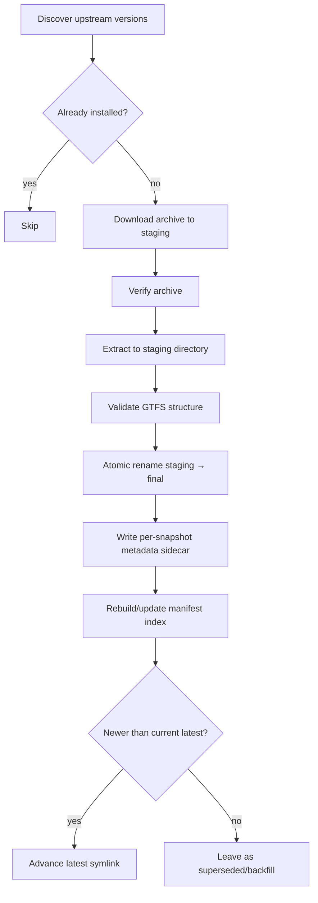
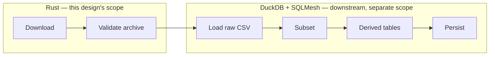

# Design: GTFS Static Auto-Downloader & Updater

## Status

Implemented — see the `ckan` crate under `domains/ingestion/`. This document reflects the design as built, including the CKAN API schema/auth details confirmed during implementation.

## Related documents

* [Runbook: Downloading the Swiss GTFS Static Timetable](../runbooks/gtfs-static-timetable-download.md) — source URL, naming conventions, and the manual process this design replaces.
* [ADR 0011 — GTFS Static Preprocessing and Zurich Operational Subset Strategy](../adr/0011-gtfs-static-preprocessing-and-zurich-subset-strategy.md) — lists "Static Feed Automation" as future work; this is that work.

---

## Problem

opentransportdata.swiss republishes the nationwide GTFS-S ("Fahrplan") feed roughly **twice a week**:

```text
https://data.opentransportdata.swiss/dataset/timetable-2026-gtfs2020
```

Right now, getting a fresh snapshot into `domains/gtfs_s/raw/` is entirely manual (see the runbook). This doesn't scale:

* Someone has to remember to check the dataset page.
* Downloads/extracts are done by hand, so naming is inconsistent and error-prone.
* Nothing tracks which version we last pulled, so we can't tell "are we stale" without a human comparing dates.
* Every consumer of the raw feed (`transit_subset/paths.py`, notebooks, future pipelines) independently re-derives "which snapshot is current" by globbing and sorting directory names.

## Goals

1. Detect when a newer GTFS-S snapshot has been published upstream.
2. Download and extract **every** snapshot newer than the one we already have (not just the latest) — so we retain a full local history and nothing gets silently skipped if the checker doesn't run for a while.
3. Atomically repoint a `latest` symlink at the newest **successfully validated** snapshot. `latest` means highest *accepted* version, not necessarily the highest version upstream has published — if the newest publish fails validation, `latest` stays put and the bad snapshot is recorded as failed, not silently retried into production.
4. Be safe to re-run on a schedule (idempotent, no duplicate downloads, no partially-extracted directories left as `latest`) and safe to recover after a crash or kill mid-run.
5. Leave a clear, inspectable, **rebuildable** record of what's been downloaded, verified, and rejected.

## Non-goals (for this iteration)

* Automatically triggering the subset/preprocessing pipeline after a new snapshot lands — that's a follow-on integration, not part of the downloader itself. The downloader's job ends at "raw data is on disk and `latest` points at it."
* Diffing snapshot contents against each other.
* Retention/pruning of old snapshot directories. **Decided:** every downloaded snapshot is retained indefinitely (see [Retention](#8-retention) below) — pruning is explicitly not something this downloader does.
* Historical backfill of every snapshot ever published — we start tracking from whatever we adopt as our first automated pull, plus whatever's already on disk.

---

## Current state (baseline)

```text
domains/gtfs_s/raw/
  gtfs_fp2026_20260805/
  gtfs_fp2026_20260729/
  ...
```

`transit_subset/paths.py` picks the newest via:

```python
GTFS_DIR = sorted(RAW_DIR.glob("gtfs_fp*"), reverse=True)[0]
```

No symlink exists yet, no version manifest exists yet.

**Storage location, decided during implementation:** the automated downloader does **not** write into `domains/gtfs_s/raw/` as the baseline above and earlier drafts of this section assumed. It writes into `data/bronze/static/` at the repo root instead — a dedicated data-lake location (bronze/silver/gold layering) independent of any one domain's source tree, since the raw snapshot store is data, not code, and doesn't belong nested inside `domains/`. Every path in §§2–7 below (`raw/<version>/`, `raw/.manifest.json`, `raw/latest`, etc.) should be read as relative to `data/bronze/static/`, not `domains/gtfs_s/raw/`. Two consequences worth being explicit about:

* The pre-existing manual snapshots shown in the baseline above are **not** picked up by the automated downloader's "already installed?" check (§2) — they live in a different directory entirely, not merely one without a sidecar. They're untouched (nothing in this design ever deletes across directory trees), but the downloader will re-download every eligible version fresh into `data/bronze/static/` rather than adopting them in place. The [cutoff version](#1-version-detection) exists partly to bound how much history that re-download implies.
* [§9 Consumer cutover](#9-consumer-cutover) below — switching `transit_subset/paths.py` from its glob to `raw/latest` — now also needs to repoint `RAW_DIR` itself at the new location, not just add the symlink. That switch is still a follow-up, not part of this implementation (see §9).

---

## Proposed design

### Pipeline overview

Each upstream version discovered goes through the same state machine. Every box below is one function in the implementation; every arrow is an error path that must be handled explicitly (see [Failure modes](#failure-modes-to-handle-explicitly) and [Recovery](#12-recovery)).



"Already installed?" is answered by the filesystem (a `raw/<version>/` directory with a valid metadata sidecar exists), not by the manifest — see below.

### Language & tooling boundary

This design intentionally spans two very different kinds of work, and deliberately uses two different tools for them:



* **Rust owns the downloader** described in this document: network I/O, filesystem staging, zip decompression, checksums, atomic rename, and locking. These are exactly the things Rust is good at, and everything in this doc through §7 (Symlink update) is scoped to this binary.
* **DuckDB + SQLMesh own everything downstream of "a raw snapshot is on disk"**: loading the raw CSVs, deriving the Zurich subset (today's ADR 0011 pipeline), building the semantic/network model (Sprint 04), and persisting Parquet artifacts. This is reasoning about the data's content, not moving bytes — Python/SQL tooling is the right fit, matching ADR 0010's own framing ("is this service primarily moving information, or reasoning about information?").

This split has a direct consequence for validation (§6): the Rust downloader only ever checks the archive is structurally sound. It does **not** parse CSV content, check columns, or verify referential integrity — those checks require an actual tabular engine and are SQLMesh's job, running later, against data the downloader has already published. `status: verified` in this design's manifest therefore means "safe to hand to the DuckDB/SQLMesh layer," not "content-validated" — see the revised §4 and §6 below.

The downloader lives at `domains/ingestion/ckan/` — a member crate of the `domains/ingestion` Cargo workspace (`domains/ingestion/Cargo.toml`), alongside the other ingestion-facing Rust crates:

```text
domains/ingestion/
  Cargo.toml          # workspace manifest — members: common, ckan, realtime, service-alerts
  common/             # shared crate (ti-common) — config loading, error types, etc.
  ckan/               # this design: CKAN version detection + GTFS-S download/verify/publish
  realtime/           # GTFS-RT ingestion
  service-alerts/     # service alerts ingestion
```

This is a better fit than the `domains/gtfs_s/downloader/` location floated in an earlier draft of this design: `domains/ingestion` is already an established Rust workspace for exactly this class of work (acquiring feeds from opentransportdata.swiss), and the `ckan` crate's `Cargo.toml` already carries the dependencies this design assumes (`reqwest`, `tokio`, `serde`/`serde_json`, `sha2`, `clap`, `anyhow`, workspace-shared via `[workspace.dependencies]`) — nothing about the tooling choices in §5/§6 requires deviating from what's already scaffolded there. Shared logic (config loading, error types) belongs in `common`/`ti-common`, matching how `realtime` and `service-alerts` already depend on it, rather than being duplicated inside `ckan`.

The GTFS-S raw data lands under `data/bronze/static/` (§2–§4 below, decided during implementation — see the storage location note above) — the `ckan` crate reads its CKAN/download config from its own domain (`domains/ingestion`) but writes snapshots into this repo-root data-lake location, not into `domains/gtfs_s/`. The existing Python subset pipeline (`domains/gtfs_s/scripts/`) will need to be pointed at the new location as part of the [Consumer cutover](#9-consumer-cutover) follow-up.

> **Governance note:** ADR 0010 establishes TypeScript and Python as the platform's two first-class languages, chosen by workload (I/O → TypeScript, computation → Python). `domains/ingestion` is already a Rust workspace covering GTFS-RT realtime ingestion and service-alerts ingestion, so this design's use of Rust extends an existing, if not yet ADR-documented, pattern rather than introducing a one-off exception. It's still worth an ADR 0010 amendment (or a new ADR) to formally recognize Rust as a third first-class language for this class of I/O-plus-systems workload, rather than leaving it as implicit precedent scattered across designs — flagging it here so it isn't lost; not resolving it in this document.

### 1. Version detection

The dataset is a CKAN catalog. Detection uses opentransportdata.swiss's CKAN Action API directly (not the public dataset HTML page):

```text
GTFS_S_CKAN_API_URL=https://api.opentransportdata.swiss/ckan-api
GET {GTFS_S_CKAN_API_URL}/action/package_show?id=timetable-2026-gtfs2020
```

which returns a JSON `resources` array with per-file metadata (name, download URL, last-modified). This is preferred over scraping the HTML dataset page, since resource ordering/markup on the page is not a stable contract.

This resolves the earlier open question: the initial probe against `data.opentransportdata.swiss/api/3/action/...` (the public dataset-browsing host) returned `403`, which was simply the wrong host — `api.opentransportdata.swiss/ckan-api` is the correct CKAN API endpoint for this platform. Access is authenticated with a token issued under the same opentransportdata.swiss application as the existing `GTFS_RT_API_TOKEN` (see `.env.example`):

```text
GTFS_S_CKAN_DATASET_ID=timetable-2026-gtfs2020
GTFS_S_CKAN_API_TOKEN=...
GTFS_S_CKAN_API_TOKEN_HASH=...
```

**Confirmed against the live API** (was open question 1): a bearer token alone is sufficient — `Authorization: Bearer {GTFS_S_CKAN_API_TOKEN}` on the `package_show` request. `GTFS_S_CKAN_API_TOKEN_HASH` is issued alongside the token as part of the same credential pair and is still loaded/required at config time for parity with `GTFS_RT_API_TOKEN`'s scheme, but the CKAN API itself did not require it to be sent.

The real response shape differs from a naive reading of the CKAN docs in one important way: `resources[].name`/`title`/`description` are **locale-keyed objects** (`{"de": "...", "en": "...", "fr": "...", "it": "..."}`), not plain filename strings. The filename (and therefore the version date) has to come from the last path segment of `resources[].url` instead. The fields this design actually uses:

```json
{
  "success": true,
  "result": {
    "resources": [
      {
        "url": "https://.../GTFS_FP2026_20260805.zip",
        "format": "ZIP",
        "last_modified": "2026-08-05T22:03:00",
        "hash": "…"
      }
    ]
  }
}
```

* `format` (case-insensitively `"zip"`) or a `.zip`-suffixed `url` identifies GTFS zip resources among the dataset's other resources.
* `last_modified` is catalog metadata from the CKAN API response itself — not an HTTP response header — and is what populates the sidecar's `publisher_last_modified` field (falling back to the `Last-Modified` HTTP header on the resource download only if CKAN didn't supply one).
* `hash`, when present, resolves open question 2 below.

Detection produces a list of `(version_id, download_url)` pairs, where `version_id` is the date extracted from the filename (normalized to `YYYYMMDD`), not the raw filename — so comparisons are robust to the naming-convention drift already observed in the dataset's history (`GTFS_FP2026_YYYYMMDD.zip` vs. the legacy hyphenated-date form).

**Cutoff version** — per the Non-goals ("we start tracking from whatever we adopt as our first automated pull, plus whatever's already on disk"), discovery ignores any upstream version older than a configurable cutoff, as if it were never published. Defaults to `20260101`; configurable via `GTFS_S_CUTOFF_VERSION` (`YYYYMMDD`, or an empty string to disable and consider the CKAN catalog's full history). This is what actually enforces the "no historical backfill" non-goal — without it, a first run against a catalog with years of resources would download every one of them.

### 2. Source of truth: filesystem first, manifest as a rebuildable index

The filesystem is authoritative. A version is "installed" if and only if `data/bronze/static/<version>/` exists **and** contains a valid metadata sidecar written at the end of a successful pipeline run (see step 4 below). The manifest is a derived cache over that filesystem state, kept around purely for fast lookups (avoiding a re-validation pass on every run) — it must never be the only place a fact is recorded.

Concretely:

* Each snapshot directory carries its own sidecar file, written once, at the very end of a successful run, never touched again:

  ```text
  data/bronze/static/gtfs_fp2026_20260805/.snapshot-meta.json
  ```

* `data/bronze/static/.manifest.json` is a rollup index built by scanning `raw/*/.snapshot-meta.json`. **If it's deleted or corrupted, it is regenerated from the sidecars on the next run** — this is a design invariant, not a nice-to-have, and should be exercised by a test (delete the manifest, re-run, confirm it's identical to before).

This gives us two independent recovery paths instead of one: losing the manifest loses nothing (rebuild from sidecars); losing a sidecar just means that one snapshot directory is treated as not-yet-installed and gets re-downloaded and re-verified, which is safe by construction.

### 3. Metadata schema

Per-snapshot sidecar (`raw/<version>/.snapshot-meta.json`) — the durable record for that one snapshot:

```json
{
  "version": "20260805",
  "source_url": "https://data.opentransportdata.swiss/dataset/.../download/gtfs_fp2026_20260805.zip",
  "downloaded_at": "2026-08-06T04:00:12Z",
  "archive_size_bytes": 812345123,
  "archive_sha256": "…",
  "publisher_last_modified": "2026-08-05T22:03:00Z",
  "etag": "\"a1b2c3\"",
  "extract_path": "data/bronze/static/gtfs_fp2026_20260805",
  "status": "verified"
}
```

Field notes:

* `archive_sha256` is computed by us over the downloaded bytes. **Resolved (was open question 2):** the CKAN resource metadata does expose a `hash` field. It's checked against `archive_sha256` when it's plausibly a hex SHA-256 (64 hex chars) — the API doesn't document which algorithm populates it, so a non-SHA-256-shaped value is logged and otherwise not treated as a mismatch. Either way, `archive_sha256` earns its keep independent of that: it lets us detect (a) truncated/corrupt downloads via `archive_size_bytes` mismatch against the `Content-Length` header, and (b) the rare case where upstream republishes a zip under the same version/date with different bytes, without needing to keep the zip around forever.
* `publisher_last_modified` comes from the CKAN resource's own `last_modified` field (see §1), falling back to the `Last-Modified` HTTP response header on the resource download if CKAN didn't supply one. `etag` comes from the `ETag` HTTP response header on that download.
* `status` is the terminal state for this version (see next section) — a sidecar is only ever written after the pipeline reaches a terminal state, so a sidecar's mere existence already tells you the run for that version finished (successfully or not); there is no `"pending"`/`"downloading"` value persisted here. As noted above, this status reflects **archive-level** structural soundness only — it is not a claim about GTFS content validity, which is checked later by the DuckDB/SQLMesh layer.

Roll-up manifest (`raw/.manifest.json`) — just an index over the sidecars, safe to regenerate:

```json
{
  "generated_at": "2026-08-06T04:00:20Z",
  "latest": "20260805",
  "versions": {
    "20260729": { "status": "superseded", "extract_path": "data/bronze/static/gtfs_fp2026_20260729" },
    "20260805": { "status": "verified",    "extract_path": "data/bronze/static/gtfs_fp2026_20260805" },
    "20260722": { "status": "failed",      "extract_path": null }
  }
}
```

### 4. Status model

Each version ends up in exactly one terminal state:

| Status | Meaning |
| --- | --- |
| `verified` | Downloaded, checksum/size sane, extracted, passed **archive-level** structural checks (§6). Currently on disk. Eligible to be `latest`. Does *not* imply GTFS content has been validated — that happens later, downstream, in the DuckDB/SQLMesh layer. |
| `superseded` | Was `verified` at some point; a newer version has since become `latest`. Still on disk, still valid — kept for history/rollback, not pruned by this design (see Non-goals). |
| `failed` | Attempted and rejected at some stage (bad download, failed validation, etc.). Staging artifacts are removed; the directory under its final name is **never created** for a failed version, so `failed` never risks being mistaken for an installed snapshot. |

There is deliberately no persisted `latest`/`active` status on the version itself — "is this the current one" is answered by whether the `latest` symlink points at it, which can change without rewriting that version's sidecar. The manifest's top-level `latest` field and the actual symlink target must always agree; the implementation should assert this on every run and treat a mismatch as a bug to fix, not a state to tolerate.

### 5. Pipeline stages in detail

For each upstream version not yet installed (per the filesystem check above), oldest first:

1. **Download** — stream the zip to a staging path (not under `raw/` yet), e.g. `raw/.staging/gtfs_fp2026_20260805.zip.part`, renamed to `.zip` only once the stream completes without error.
2. **Verify archive** — compare downloaded byte count against the `Content-Length` response header (catches truncated transfers), compute `archive_sha256`. This happens **before** extraction, so we never spend time unzipping something we already know is broken.
3. **Extract to staging** — unzip into a staging directory, e.g. `raw/.staging/gtfs_fp2026_20260805/`, never directly under its final name.
4. **Validate archive structure** — see next section. Runs against the *staging* directory, before anything is promoted. This is an archive-level check only (the Rust binary's job ends here) — it does not parse CSV content.
5. **Atomic rename** — only on successful validation, `rename()` the staging directory to its final name (`raw/gtfs_fp2026_20260805/`). Same-filesystem renames are atomic, so this is the one moment a snapshot goes from "doesn't exist" to "fully exists" — there is no intermediate state a concurrent reader could observe.
6. **Write sidecar, update manifest, advance `latest`** — in that order, per the sections above.

On failure at any stage: delete whatever staging artifacts exist for that version, do **not** create `raw/<version>/`, and record the outcome (see [Recovery](#12-recovery) for what "record" means when the process itself died mid-stage rather than failing cleanly).

### 6. Validation: archive-level (Rust, this design) vs. content-level (DuckDB/SQLMesh, downstream)

The original draft of this section proposed doing all structural validation — including CSV parsing, column checks, and referential integrity — inside this design's own pipeline. Given the [language boundary](#language--tooling-boundary) above, that's the wrong split: CSV/SQL-shaped validation belongs with the tools built for it, not hand-rolled in the downloader. This section now separates the two tiers explicitly.

#### Tier 1 — archive-level (in scope here, gates `verified`/`latest`)

Performed by the Rust binary against the zip's central directory and the extracted files on disk, without parsing any CSV content:

* The zip is a valid, uncorrupted archive (opens cleanly, entries match their recorded CRC32).
* The archive contains the required GTFS member files by name: `stops.txt`, `trips.txt`, `routes.txt`, `stop_times.txt`, `calendar_dates.txt` (plus `agency.txt`/`calendar.txt` if present).
* Each required member has non-zero size, both in the zip's own entry metadata and after extraction (catches truncated members that a naive "does the file exist" check would miss).

This is cheap, fast, and squarely in Rust's wheelhouse (zip/filesystem metadata, no tabular reasoning). It's also a weaker guarantee than the original draft implied: "**Tier 1 passed**" means *the archive is intact and shaped like a GTFS feed*, not that its contents are semantically valid GTFS. That distinction is now explicit in the [status model](#4-status-model) — `verified` covers Tier 1 only.

#### Tier 2 — content-level (downstream, not run automatically by the downloader in v1)

This is where the checks from the original draft still apply, just relocated:

* **Parseability & required columns** — e.g. `stops.stop_id`/`stop_name`/`stop_lat`/`stop_lon`, `trips.trip_id`/`route_id`, `stop_times.trip_id`/`stop_id`/`stop_sequence` — drift here should fail loudly instead of surfacing as a confusing error three pipeline stages later.
* **Row-count sanity** — within a sane order of magnitude of what ADR 0011 documented (hundreds of thousands to tens of millions of rows depending on the table), not just `> 0`.
* **Referential integrity** — every `trips.route_id` resolves to a `routes.route_id`; every `stop_times.trip_id`/`stop_id` resolves to `trips`/`stops`.
* **Geographic sanity** — `stops.stop_lat`/`stop_lon` fall within Switzerland's bounding box (roughly lat 45.8–47.9, lon 5.9–10.5). Since ADR 0011's Zurich subset is derived purely from `stop_name`, garbage coordinates wouldn't even trip that pipeline's own logic — this check exists specifically to catch that blind spot.

**Technology**: DuckDB loading the raw CSVs, with these invariants expressed as **SQLMesh audits** on the models that load and subset the data — row-count and range checks, and referential-integrity anti-join checks, are exactly what SQLMesh's audit framework is for, and this gives versioned, independently-runnable tests instead of ad-hoc scripts. This lives in the DuckDB/SQLMesh layer shown above, not in this downloader's codebase.

Per the resolved decision in Non-goals, **the downloader does not trigger this tier automatically in v1** — a `verified` snapshot sits on disk and behind `latest` without its content having been checked yet. Content validation happens whenever the SQLMesh subset pipeline next runs against it (manually, for now). This is a real gap worth naming plainly: between a snapshot becoming `latest` and someone next running the subset pipeline, `latest` could point at archive-sound-but-content-broken data. Automatic triggering (or at least automatic Tier 2 validation without full pipeline execution) is the natural next iteration once both halves exist — see Non-goals and the relevant open question.

> **Relationship to ADR 0011**: ADR 0011 currently mandates Polars as the processing engine for the existing Python subset pipeline. Adopting SQLMesh for subsetting and derived tables, as sketched here, is a bigger decision than this downloader design and likely warrants its own ADR (or an amendment to 0011) rather than being settled as a side effect of this document. Noted here so it isn't lost, not resolved here.

### 7. Symlink update

After all missing versions are downloaded (or after each one, order doesn't matter for correctness — only the final state does), repoint `latest` at the newest **successfully verified** version:

```bash
ln -sfn gtfs_fp2026_20260805 data/bronze/static/latest
```

`ln -sfn` is already atomic on POSIX filesystems (it creates a new symlink and renames it over the old one), which is what makes this safe to do while other processes might be reading through `latest` — readers either see the old target or the new one, never a broken/missing link. No custom atomic-swap logic is needed beyond using `-fn` (not `-f` alone, which would put the new link *inside* an existing symlinked directory instead of replacing it — a documented `ln` footgun worth calling out explicitly in the implementation).

The `latest` pointer only ever advances to a newer version. The updater should never repoint it backwards; if a downloaded snapshot fails verification, `latest` simply doesn't move.

### 8. Retention

**Decided:** every downloaded snapshot is retained indefinitely. The downloader never deletes a `verified` or `superseded` snapshot directory.

Storage lifecycle is treated as an infrastructure concern, not a downloader concern — if retained snapshots become material in storage cost, older ones can be moved to lower-cost object storage (e.g. a MinIO lifecycle policy, or an S3-Glacier-equivalent tier) entirely outside this design, without the downloader's logic changing. The downloader's contract is "snapshots exist at `extract_path` and are never silently removed by it" — where they physically live over time is a separate, later decision.

### 9. Consumer cutover

Once the symlink exists and is maintained automatically, `transit_subset/paths.py` should be changed from:

```python
RAW_DIR = GTFS_S_DIR / "raw"
GTFS_DIR = sorted(RAW_DIR.glob("gtfs_fp*"), reverse=True)[0]
```

to:

```python
RAW_DIR = PROJECT_ROOT / "data" / "bronze" / "static"
GTFS_DIR = RAW_DIR / "latest"
```

Two changes bundled together, not one: this both adopts the `latest` symlink *and* repoints `RAW_DIR` at `data/bronze/static/`, the location the automated downloader actually writes to (see the storage location note under [Current state (baseline)](#current-state-baseline) — it differs from what earlier drafts of this design, and the runbook, assumed). Until this cutover happens, `transit_subset/paths.py` will keep globbing the old, no-longer-updated `domains/gtfs_s/raw/` directory and won't see any snapshot the automated downloader publishes.

This is a follow-up change once the downloader is proven to keep the symlink correct — not part of this implementation.

### 10. Scheduling

The dataset updates roughly twice a week with no fixed time-of-day guarantee mentioned by the publisher, and explicitly *not* on Swiss public holidays. A daily check is more than sufficient — cheap when there's nothing new (one API call), and it comfortably beats the twice-weekly cadence without needing to reverse-engineer their exact publish schedule.

Mechanism is intentionally left open for the implementation phase (candidates: a cron entry, a scheduled GitHub Action, or a script hook alongside the existing ingestion tooling) — not a design concern for this doc.

### 11. Locking

Two overlapping runs racing to write the same staging paths, or one advancing `latest` while another is mid-validation, is a small amount of implementation effort to prevent and a large amount of pain to debug if it happens unguarded. This deserves an explicit protocol, not just a footnote:

1. **Acquire** — on startup, atomically create `raw/.updater.lock` (e.g. `open(..., O_CREAT | O_EXCL)`, which fails if the file already exists — no separate "check then create" race). Write the current PID and start timestamp into it.
2. **Staleness check on contention** — if the lock file already exists, read the PID inside it. If that PID is not a running process on this host, treat the lock as stale (left behind by a crash — see Recovery), log loudly, remove it, and retry acquisition once. If the PID *is* running, or the lock's host doesn't match, exit cleanly — another run is genuinely in progress.
3. **Run** — the entire discover → download → verify → extract → validate → publish pipeline, for all pending versions, happens while holding the lock.
4. **Release** — remove `raw/.updater.lock` in a `finally`/`defer` so it's released on both success and handled failure.
5. **Done** — a process that dies without releasing the lock (killed, OOM, host reboot) leaves it behind; the staleness check in step 2 is what makes the *next* run self-heal instead of requiring manual intervention.

This is maybe 20 lines of implementation. The alternative — two runs racing on the same staging directory, or `latest` flapping between two versions mid-swap — is the kind of bug that's expensive precisely because it's rare and hard to reproduce. Worth the 20 lines.

### 12. Recovery

The pipeline is designed so that **the only unsafe moment is inside a single stage**, never across stages — every inter-stage boundary is a filesystem state that's either "hasn't happened" or "fully happened." That constrains what a crash can leave behind, which makes recovery mostly mechanical:

| Left behind after a crash | Why it's safe | Recovery action |
| --- | --- | --- |
| A file under `raw/.staging/*.zip.part` or `raw/.staging/<version>/` | Staging paths are never treated as installed by the "already installed?" check | Delete on next run's startup, unconditionally, before doing anything else. Staging is always disposable. |
| `raw/.updater.lock` with a dead PID | Lock only gates concurrent runs, carries no data | Detected and cleared by the staleness check in Locking, step 2. |
| A `raw/<version>/` directory that exists but has no `.snapshot-meta.json` | Can only happen if something bypassed the atomic-rename step (e.g. manual filesystem tampering) — the pipeline itself never leaves this state, since the sidecar is written immediately after the rename and nothing else creates `raw/<version>/` | Not treated as installed (sidecar is the source of truth per step 2); safe to re-run, which re-downloads and overwrites it. Worth a startup warning since it indicates something outside the pipeline touched `raw/`. |
| `raw/.manifest.json` missing, truncated, or stale relative to the sidecars | It's a derived cache, never authoritative | Regenerate from `raw/*/.snapshot-meta.json` before doing anything else on every run — not just when it's detected missing, so drift can't accumulate silently. |
| `latest` symlink pointing at a version whose sidecar says `status: failed` (shouldn't happen, but) | Indicates a bug, not a recoverable runtime state | Fail loudly on startup rather than silently "fixing" it — this is the assertion mentioned in the Status model section, and it should stop the run rather than guess which side is right. |

The general recovery posture: **on every run, before touching the network, clean staging, reconcile the manifest against the sidecars, and verify `latest` agrees with the manifest.** A run that starts from a clean, self-consistent state can treat every subsequent failure as "just" a failure of the current version's pipeline, not a threat to previously-installed versions.

---

## Failure modes to handle explicitly

| Scenario | Handling |
| --- | --- |
| Upstream unreachable / API returns error | Log and exit non-zero; `latest` and manifest untouched. No partial state. |
| Zip downloads but is corrupt / fails to extract | Discard staging artifacts, record `status: failed` outcome, do not create `raw/<version>/`, retry next run. |
| Extracted snapshot fails structural GTFS validation | Same handling as above — don't let a malformed snapshot become `latest`. |
| Two runs overlap (e.g. a slow run still going when the next scheduled run fires) | Prevented by the locking protocol above, not just noted as a risk. |
| Process is killed mid-run (OOM, host reboot, manual kill) | Covered by Recovery above — staging is disposable, the lock self-heals, the manifest is regenerable. |
| Disk fills up from retained snapshots | Accepted per the [Retention](#8-retention) decision — indefinite retention is intentional; if it becomes a real problem, it's solved at the infrastructure/storage layer, not by changing this design. |

---

## Resolved decisions

Recorded here so the reasoning isn't lost, since each of these started as an open question in an earlier draft of this design:

* **CKAN API access** (was open question 1) — resolved. The correct endpoint is `https://api.opentransportdata.swiss/ckan-api`, authenticated with a bearer token issued under the same opentransportdata.swiss application as `GTFS_RT_API_TOKEN` (see `.env.example` and [§1](#1-version-detection)). The earlier `403` was against the wrong host, not a real auth blocker.
* **Token/header wiring** (was open question, folded into the item above) — resolved. `Authorization: Bearer {GTFS_S_CKAN_API_TOKEN}` on the `package_show` request is sufficient; `GTFS_S_CKAN_API_TOKEN_HASH` is not required by this endpoint (still provisioned as part of the credential pair; see §1).
* **Upstream-provided checksums** (was open question 2) — resolved. The CKAN resource metadata exposes a `hash` field, checked against our own `archive_sha256` when it's shaped like a hex SHA-256. See [§3](#3-metadata-schema).
* **Retention policy** (was open question) — resolved. Retain every snapshot indefinitely; storage lifecycle is an infrastructure concern, not the downloader's. See [§8](#8-retention).
* **Downstream trigger on successful download** (was open question) — resolved for v1. The downloader does **not** automatically trigger the DuckDB/SQLMesh subset pipeline. It publishes a `verified` (archive-level) snapshot and advances `latest`; downstream automation is a later iteration. See [§6](#6-validation-archive-level-rust-this-design-vs-content-level-duckdbsqlmesh-downstream).

## Open questions

Still open:

1. **Rust as a third platform language** — flagged under [Language & tooling boundary](#language--tooling-boundary): this deserves its own ADR (or an amendment to ADR 0010) before it's treated as settled precedent for future services.
2. **SQLMesh adoption for the subset/derived-table stages** — flagged under [§6](#6-validation-archive-level-rust-this-design-vs-content-level-duckdbsqlmesh-downstream): this extends into ADR 0011's territory (which currently mandates Polars) and likely wants its own ADR rather than being decided as a side effect of this document.
3. **Automatic Tier 2 (content) validation without full pipeline execution** — once both the downloader and the SQLMesh layer exist, is there a lightweight way to content-validate a new `latest` without running the full subset pipeline, to shrink the window where `latest` is archive-sound but content-unchecked? Not needed for v1 given the resolved no-auto-trigger decision, but worth a look once both halves exist.

---

## Next step

Implement this design in the `ckan` crate under `domains/ingestion/` (§§1–7): CKAN-based version detection, the download → verify → extract → validate(archive) → publish pipeline, the manifest/sidecar scheme, symlink management, locking, and recovery.
