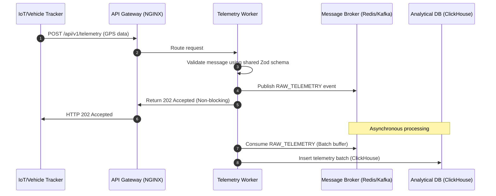
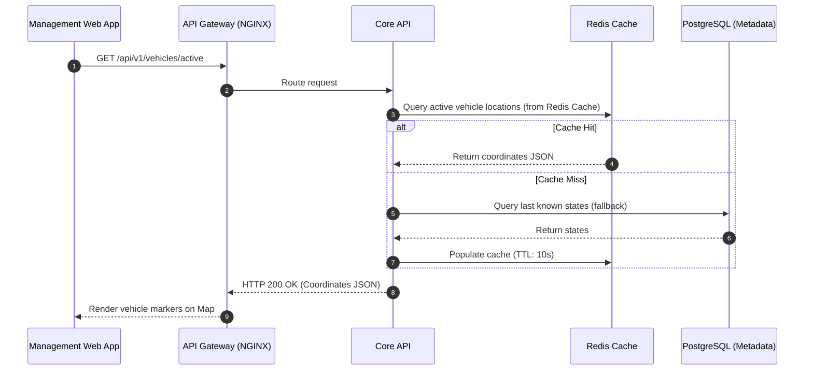

# Design Document: Request Lifecycle

This document traces the data lifecycle of the two primary system operations:

1. Vehicle Telemetry Ingestion (High throughput, time-series)
2. Live Vehicle Location Retrieval (Low latency, read)

## 1. Vehicle Telemetry Ingestion Lifecycle

## 2. Live Vehicle Location Query Lifecycle

