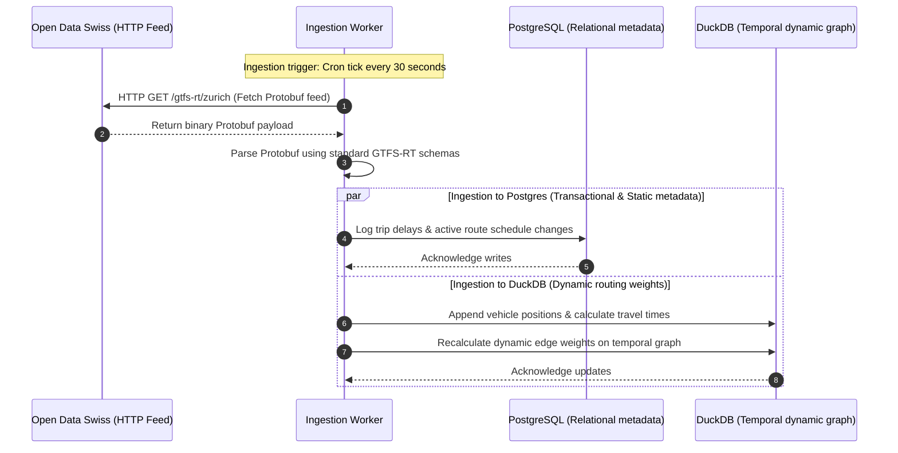
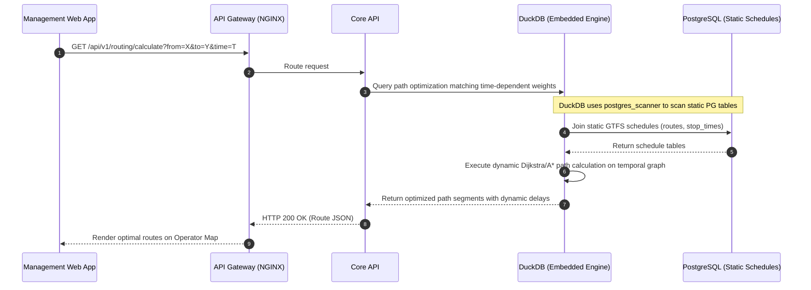

# Design Document: Request Lifecycle

This document traces the data lifecycle of the two primary system operations:

1. Swiss GTFS-RT Ingestion Lifecycle (30s Polling & Protobuf parsing)
2. Live Vehicle Location & Routing Pathfinding Retrieval (Dynamic Graph computation)

## 1. Swiss GTFS-RT Ingestion Lifecycle

## 2. Live Routing Pathfinding & Location Query Lifecycle

