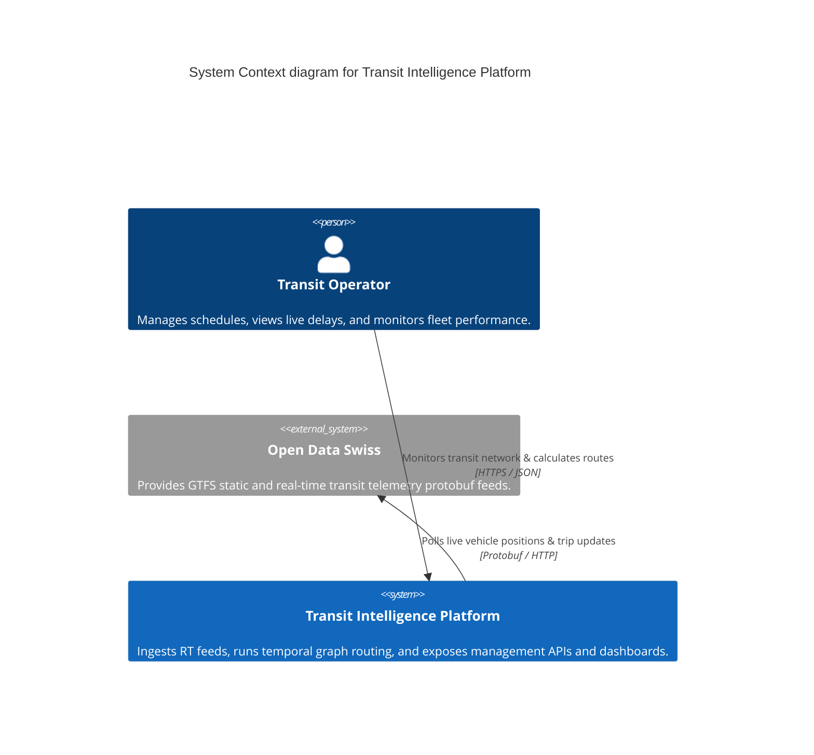
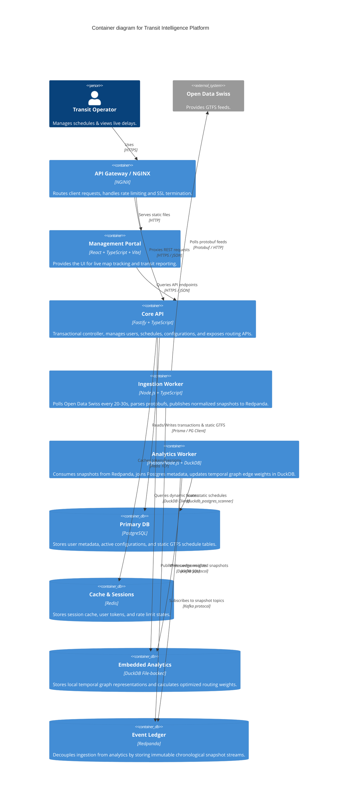
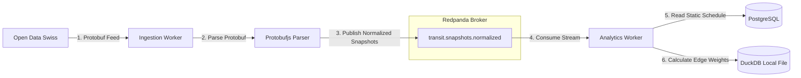
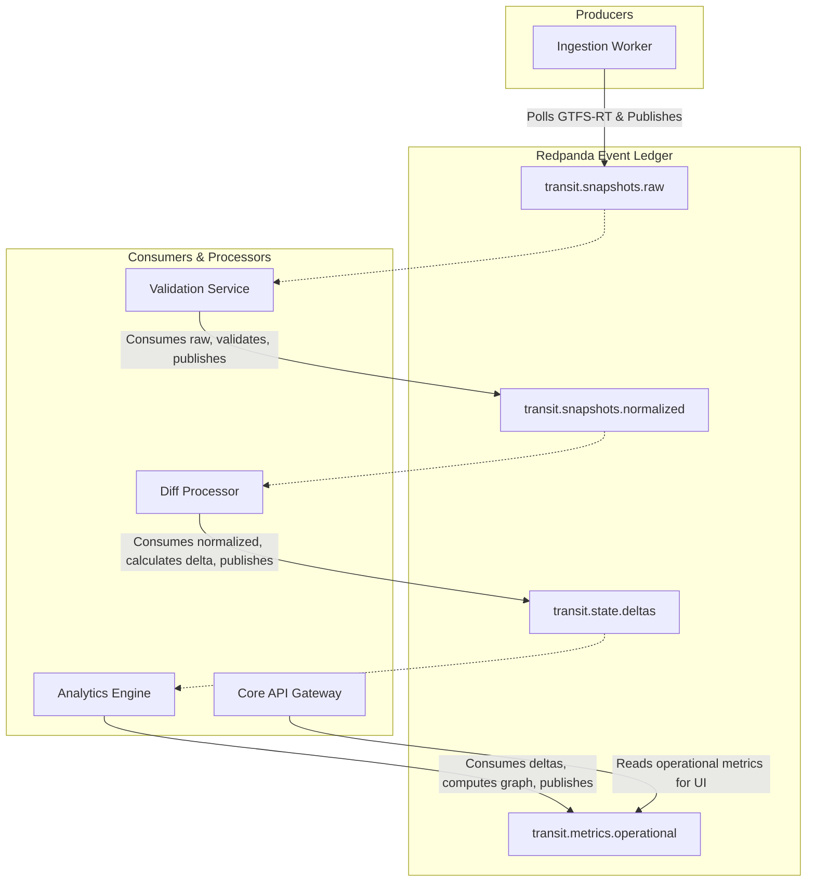

# Architecture Diagrams & Visualizations

This document hosts the official architectural diagrams for the Transit Intelligence Platform, illustrating system boundaries, container responsibilities, data flow pipelines, and event-driven semantics.

---

## 1. C4 System Context Diagram

The C4 System Context diagram provides a high-level view of how users (Transit Operators) and external systems (Open Data Swiss) interact with the platform.

---

## 2. C4 Container Diagram

The C4 Container diagram details the internal services, workers, and data stores, along with their communication protocols.

---

## 3. Data Flow Diagram (Ingestion Pipeline)

This diagram outlines how real-time data flows from the public Swiss feeds to our operational graph store.

---

## 4. Event Flow Diagram (Redpanda Integration)

This diagram focuses on topic topology and the pub-sub separation between services.

